# Mark Barney’s ARC-3 reasoning traces

66 complete synthetic reconstructions across 25 games. Prepared by GPT-6 (Codex), 30 September 2026.

These traces expand Mark’s accounts using screenshots and game mechanics. Missing actions and expectations are reconstructed. Each entry links an independently replayed winning demonstration of the same level; that demonstration is not claimed to be Mark’s exact action sequence.

## Axis Reflectors (ar25)

[Game write-up](https://arc3.markbarney.net/arc3/games/ar25)

### Level 2 — ar25:5e5618442371e106

**Source note:** The first two levels. He mostly understood them. Then it got far too complex, like very long or complicated Lego pieces: he could not group and count that many dots. He had played it before and got nowhere on the later levels.

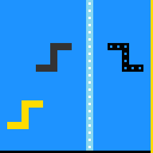

**Situation.** A black shape, its gray reflection and a yellow target sit on opposite sides of a vertical mirror. I can change which object is selected.

**Working hypothesis.** The reflection should move opposite the piece horizontally. Moving the mirror might move the reflection farther without changing the piece.

**Action.** Select the mirror and move it sideways, then select the black piece and adjust its vertical position.

**Expected result.** The mirror move should change the reflection's horizontal alignment; moving the piece vertically should then bring the reflected shape onto the target.

**Result.** The movable mirror changes the reflection while the black piece stays put. The piece and mirror provide separate ways to align the yellow cells.

**Revised understanding.** I should solve the horizontal and vertical constraints separately instead of trying to drag the reflection itself.

**Next move.** Check which yellow cells remain uncovered and adjust the selected piece or mirror to eliminate those mismatches.

**Reconstruction:** action inferred_from_game_evidence; expectation inferred_from_game_evidence; result mechanics_reconstruction.

**Executable example:** [verified replay transitions](evidence/ar25.transitions.jsonl.gz), level 2, 11 actions. Filter by the level field; the final transition records the clear.

### Level 7 — ar25:c5afa09a6fd575d6

**Source note:** Level 7. Even copying the replay he could not tell whether he was close to winning. He had to cheat the last two levels, and even then it was hard and took an eternity.

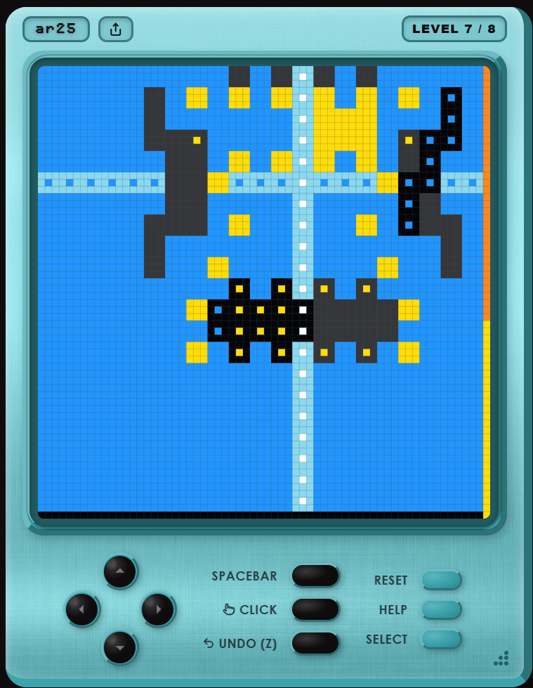

**Situation.** The level-7 capture has two axes, overlapping black and gray shapes, and many yellow cells. I have been copying a successful replay without understanding my progress.

**Working hypothesis.** The large silhouette is too difficult to judge at once. Each remaining yellow target can instead be checked for coverage by a real piece or any reflection.

**Action.** Pause after each replay move, identify the selected object by its dots, and compare the exposed yellow cells before and after it.

**Expected result.** I should be able to tell whether that move covered new targets or uncovered cells that were already satisfied.

**Result.** The screenshot shows yellow centers through occupied cells as well as exposed yellow cells; the code checks all target cells. A move can improve one region while disturbing another.

**Revised understanding.** Copying inputs gets me through, but tracking target coverage explains why they work. The whole board need not resemble one simple shape.

**Next move.** Use the verified level-7 demonstration to examine the last upward move, comparing the remaining targets before the level advances.

**Reconstruction:** action expanded_from_recorded_action; expectation inferred_from_game_evidence; result mechanics_reconstruction.

**Executable example:** [verified replay transitions](evidence/ar25.transitions.jsonl.gz), level 7, 37 actions. Filter by the level field; the final transition records the clear.

## Buoyant Pontoons (bp35)

[Game write-up](https://arc3.markbarney.net/arc3/games/bp35)

### Level 1 — bp35:3b461c75c5661ba9

**Source note:** The rising purple-and-black mass under you on the first levels. It basically never fires in normal play; he never saw it reach him.

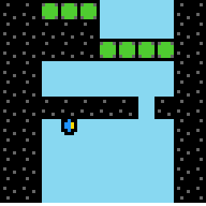

**Situation.** A purple-and-black mass sits below my piece, but ordinary successful movement has not let it catch me.

**Working hypothesis.** It may advance only under a particular kind of move rather than continuously with time.

**Action.** Compare a successful sideways move with a blocked move, tracking the action count as well as the mass.

**Expected result.** If every input advances it, both should make it rise. If failed movement triggers it, only some blocked inputs should do so.

**Result.** The checked rule advances it one row after a blocked move when the move count is even. My ordinary route rarely exposed that condition.

**Revised understanding.** Not seeing a hazard activate did not mean it was decorative. The trigger depends on both movement failure and parity.

**Next move.** Avoid wasting blocked moves near the mass and keep testing input conditions separately from elapsed animation time.

**Reconstruction:** action inferred_from_game_evidence; expectation inferred_from_game_evidence; result mechanics_reconstruction.

**Executable example:** [verified replay transitions](evidence/bp35.transitions.jsonl.gz), level 1, 15 actions. Filter by the level field; the final transition records the clear.

### Level 2 — bp35:13102f824fab1292

**Source note:** A purple tile marked with a bit of yellow and white. Being carried onto it plays what looks like a teleport into the void. It is an instant death, every time he hit one, on every level. The void effect is only the death animation; nothing teleports.

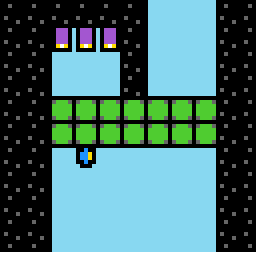

**Situation.** A marked purple tile produces a void-like animation when the forced slide carries me onto it.

**Working hypothesis.** It looks like a teleport, but that interpretation is wrong if my run ends instead of placing me somewhere else.

**Action.** Let the recorded slide finish and inspect the resulting state rather than naming the animation from its appearance.

**Expected result.** A teleport should preserve play at another location; a lethal tile should end or rewind the attempt.

**Result.** The reported encounter kills the player. The code calls lose when the pull carries the piece into a spike, while a sideways approach only bumps.

**Revised understanding.** I need to distinguish the entry direction and the tile's markings. Purple alone is not a sufficient hazard label.

**Next move.** Undo the bad slide where available and choose a branch whose forced landing avoids the marked spike.

**Reconstruction:** action inferred_from_game_evidence; expectation inferred_from_game_evidence; result human_report.

**Executable example:** [verified replay transitions](evidence/bp35.transitions.jsonl.gz), level 2, 43 actions. Filter by the level field; the final transition records the clear.

### Level 4 — bp35:b9f5620360718943

**Source note:** The exit and the flip tile are never on screen at the start. Every level means exploring the whole map to find them. He thinks that exploring, more than any single mechanic, is what makes this game hard for an agent and not for a person.

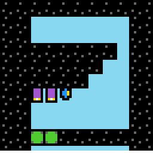

**Situation.** The visible shaft contains no exit or pull-reversal tile, and the viewport shows only part of the level.

**Working hypothesis.** The objective may exist beyond the starting view. Treating the current screen as the complete map would make the game seem impossible.

**Action.** Explore a reachable branch beyond the viewport edge and track which parts of the shaft become visible.

**Expected result.** I expect the view to reveal new terrain and eventually a route or control missing from the starting screen.

**Result.** The player reports that finding the exit and flip tile requires exploring the map; level 4 places the red flip tile above the opening view.

**Revised understanding.** The map and the screen are different objects. A missing visible route calls for exploration before a conclusion that no route exists.

**Next move.** Record where the flip tile is, then plan how changing the pull will make the exit reachable.

**Reconstruction:** action inferred_from_game_evidence; expectation inferred_from_game_evidence; result human_report.

**Executable example:** [verified replay transitions](evidence/bp35.transitions.jsonl.gz), level 4, 23 actions. Filter by the level field; the final transition records the clear.

### Level 2 — bp35:cc9ba089f0b47009

**Source note:** Every left or right press sets off the slide, and you often cannot see where it will carry you. Undo is what makes it finishable: the only way to take back a slide onto a spike or into a wasted detour. One of three public games (with lf52 and sk48) where Undo is load-bearing, not a convenience.

**Situation.** A left or right input starts a longer automatic slide, sometimes beyond what I can see.

**Working hypothesis.** I control the initial lateral step, but gravity or buoyancy determines the rest of the move. A bad landing may still be recoverable.

**Action.** Take a branch, observe the full slide, and use ACTION7 if it carries me onto a spike or into an unhelpful detour.

**Expected result.** I expect Undo to restore the previous board position so I can try the other branch.

**Result.** The player used Undo to back out of bad slides. A single sideways input has consequences beyond its first visible displacement.

**Revised understanding.** The decision is which complete slide to initiate, not merely whether to move one square left or right.

**Next move.** From the restored position, compare the other branch's eventual landing with the route I need.

**Reconstruction:** action expanded_from_recorded_action; expectation inferred_from_game_evidence; result human_report.

**Executable example:** [verified replay transitions](evidence/bp35.transitions.jsonl.gz), level 2, 43 actions. Filter by the level field; the final transition records the clear.

### Level 2 — bp35:485b5c02e03438bc

**Source note:** The shaft splits into branches. Which way you step, combined with the slide, decides which branch you end up in, and whether you land on a purple tile or a green one.

**Situation.** The shaft divides into branches, and a sideways step is followed by forced vertical movement.

**Working hypothesis.** Choosing a branch requires predicting both the sideways displacement and the subsequent slide.

**Action.** Step toward one branch and watch where the piece finally comes to rest.

**Expected result.** I expect the piece to follow the open shaft until solid material stops it; the stopping tile may be safe green or a marked purple hazard.

**Result.** The reported branch and landing depend on the initial direction together with the forced slide.

**Revised understanding.** My route plan needs the final landing of each input. The branch closest to the exit on screen may lead to the wrong vertical channel.

**Next move.** Map the landing for each available direction and choose the transition that keeps a safe route forward.

**Reconstruction:** action expanded_from_recorded_action; expectation inferred_from_game_evidence; result human_report.

**Executable example:** [verified replay transitions](evidence/bp35.transitions.jsonl.gz), level 2, 43 actions. Filter by the level field; the final transition records the clear.

### Level 4 — bp35:1e707232d829dc03

**Source note:** What worked on the earlier levels does not work: this level needs you to sink, not rise. The tile that flips the pull sits above the visible frame at the start, so you have to go looking before you know it exists. His read: a human explores and finds it; an agent that sticks with what worked on earlier levels probably does not.

**Situation.** The route now requires sinking, although rising worked earlier. I do not see a way to reverse the pull in the starting view.

**Working hypothesis.** A new control may reverse the pull, and it may be hidden above the viewport rather than absent.

**Action.** Float upward and explore past the top of the initial view.

**Expected result.** I expect to find terrain or an interaction that explains how downward travel becomes possible.

**Result.** The player finds the red flip tile above the starting view; red blocks reverse the pull from level 4 onward.

**Revised understanding.** The earlier movement rule still exists, but the level introduces a way to change its direction. Repeating the old route is insufficient.

**Next move.** Reach the red tile, reverse the pull and reassess which downward channel leads toward the exit.

**Reconstruction:** action expanded_from_recorded_action; expectation inferred_from_game_evidence; result human_report.

**Executable example:** [verified replay transitions](evidence/bp35.transitions.jsonl.gz), level 4, 23 actions. Filter by the level field; the final transition records the clear.

### Level 6 — bp35:07f57fa3f8798567

**Source note:** No flip tile anywhere near the start. The red tile was in that far corner. Finding the flip tile costs more on every level: just above the start on level 4, a long round trip on level 6.

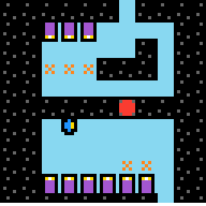

**Situation.** There is no red flip tile near the starting area. The reversal mechanism should still be relevant on this level.

**Working hypothesis.** I have searched too locally. The tile may be in an unexplored corner of the larger shaft.

**Action.** Travel to the bottom and then explore upward toward the opposite corner, keeping track of the regions already visited.

**Expected result.** I expect the remaining unexplored region to contain the missing control or reveal another route.

**Result.** The player finds the red tile in the far corner after the long round trip.

**Revised understanding.** The growing difficulty includes search distance. Failure to find a familiar mechanism nearby does not justify abandoning it.

**Next move.** Use the discovered location to plan the reversal route without repeating already explored dead ends.

**Reconstruction:** action expanded_from_recorded_action; expectation inferred_from_game_evidence; result human_report.

**Executable example:** [verified replay transitions](evidence/bp35.transitions.jsonl.gz), level 6, 100 actions. Filter by the level field; the final transition records the clear.

### Level 8 — bp35:c50ba698896635c9

**Source note:** A new mass of plain solid purple blocks, with no yellow and white marks, plus orange circle tiles, orange checkered tiles and a pink plus. The purple spread after some of his mistakes, and some mistakes could not be fixed by playing on: they needed Undo or a full Reset.

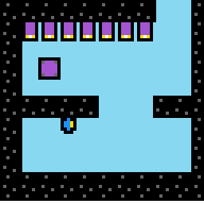

**Situation.** Plain purple blocks appear without the yellow-and-white spike markings. Orange controls and a pink exit are also visible.

**Working hypothesis.** These plain blocks may alter the terrain rather than act like the marked purple spikes from earlier levels.

**Action.** Click a plain purple block while tracking its empty neighboring cells, then use the resulting material as a bridge toward the flip tile.

**Expected result.** I expect a local terrain change that may create support, but it could also block a route if I choose the wrong location.

**Result.** The clicked block is removed and adjacent empty cells fill with purple. The player used this as bridge material and needed Undo or Reset after some mistakes.

**Revised understanding.** The click redistributes terrain; it does not simply delete an obstacle. I need to predict the new occupied cells before committing.

**Next move.** Undo an obstructive expansion, then choose a block whose neighboring growth supports the route to the flip tile.

**Reconstruction:** action expanded_from_recorded_action; expectation inferred_from_game_evidence; result human_report.

**Executable example:** [verified replay transitions](evidence/bp35.transitions.jsonl.gz), level 8, 42 actions. Filter by the level field; the final transition records the clear.

## Compass Dye (cd82)

[Game write-up](https://arc3.markbarney.net/arc3/games/cd82)

### Level 1 — cd82:47e967dc1068632d

**Source note:** A paint bucket that moves around the canvas like a compass, and colors to stamp. Easy once you see you are stamping colors, and that the order you stamp them in matters. The weird part is the compass directions: the controls you expect to work don't really work at the start, and it was just weird to navigate around and move it.

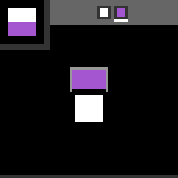

**Situation.** A bucket or selector moves around eight stations, and successive colored throws paint a central pattern.

**Working hypothesis.** I am assuming ordinary grid navigation, but the allowed motion may follow the perimeter. Later throws may overwrite earlier colors.

**Action.** Move to a neighboring perimeter station, choose a color and fire; then compare the overlap with an earlier throw.

**Expected result.** I expect valid station changes to follow the ring, and a new throw to determine the final color wherever it overlaps old paint.

**Result.** The rule check confirms perimeter movement and overwriting. Inputs that try to cut across the ring leave the bucket in place while spending an action.

**Revised understanding.** My plan needs both a route around the ring and a paint order. A geometrically plausible arrow is not always a legal station move.

**Next move.** Work backward from the reference pattern to choose which color must be thrown last in each overlapping region.

**Reconstruction:** action inferred_from_game_evidence; expectation inferred_from_game_evidence; result mechanics_reconstruction.

**Executable example:** [verified replay transitions](evidence/cd82.transitions.jsonl.gz), level 1, 13 actions. Filter by the level field; the final transition records the clear.

## Coded Notches (cn04)

[Game write-up](https://arc3.markbarney.net/arc3/games/cn04)

### Level 1 — cn04:defef421d56fa6b3

**Source note:** The pieces joining up. It looks like welding, but it is really connecting pieces.

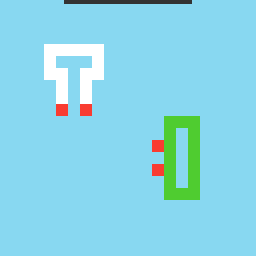

**Situation.** Separate white and green parts have colored marks on their edges, and the pieces appear to join when brought together.

**Working hypothesis.** The objective is matching connector marks, not covering a silhouette or merely making the parts touch.

**Action.** Select one part, rotate it and slide it until its printed marks align with matching marks on the other part.

**Expected result.** I expect correct mark alignment to satisfy the connection, while arbitrary edge contact will not be enough.

**Result.** The game's connection checks use the printed marks. The welding-like appearance represents joining compatible connectors.

**Revised understanding.** I should plan around the marks and orientation rather than the visual metaphor of melting pieces together.

**Next move.** Inspect every remaining connector and choose the next rotation or translation that pairs matching marks.

**Reconstruction:** action inferred_from_game_evidence; expectation inferred_from_game_evidence; result mechanics_reconstruction.

**Executable example:** [verified replay transitions](evidence/cn04.transitions.jsonl.gz), level 1, 14 actions. Filter by the level field; the final transition records the clear.

### Level 5 — cn04:b07bfc981ee7e599

**Source note:** On level 5 one piece, the yellow one, grows instead of turning. You have to grow the yellow piece all the way, or you never see the parts you need to attach to. Only 6 levels, but devious: looking at level 5 you don't have all the information you need to plan it, which would throw off any player who thinks they already know the game.

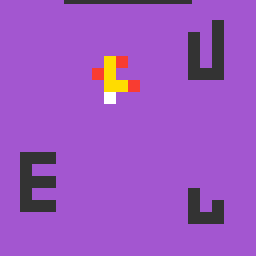

**Situation.** The yellow piece behaves differently from the rotatable pieces I used on the first four levels.

**Working hypothesis.** Spacebar should rotate it as before; if it grows instead, this piece has a different interaction rule.

**Action.** Select the yellow part and press ACTION5, then repeat while watching for newly exposed connector marks.

**Expected result.** I initially expect another orientation of the same shape.

**Result.** The piece grows through its available sizes instead of rotating. The attachment marks needed for the level only appear when it is fully grown.

**Revised understanding.** I cannot solve the initial picture as a complete connector puzzle. Some of the information is concealed in the piece's later sizes.

**Next move.** Grow the yellow part fully, inspect the revealed marks and then plan how to connect the other pieces.

**Reconstruction:** action expanded_from_recorded_action; expectation expanded_from_recorded_expectation; result human_report.

**Executable example:** [verified replay transitions](evidence/cn04.transitions.jsonl.gz), level 5, 48 actions. Filter by the level field; the final transition records the clear.

## Deck Control (dc22)

[Game write-up](https://arc3.markbarney.net/arc3/games/dc22)

### Level 1 — dc22:ca76d471b6324cca

**Source note:** Pieces of floor that change when you press the panel buttons. It seems to be building a path.

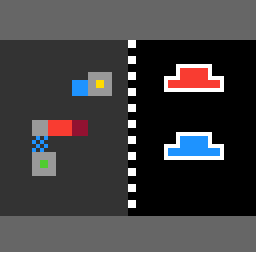

**Situation.** The green player is separated from the yellow goal by missing or checkered floor, and the panel has red and blue buttons.

**Working hypothesis.** The panel probably changes the corresponding floor rather than moving the player. I need to build a walkable route.

**Action.** Press the blue control to make its tiles solid and use the red control to swing the red bar into a useful orientation.

**Expected result.** I expect the colored geometry to change while the player's position stays fixed, creating a continuous route.

**Result.** The buttons toggle blue floor and rotate the red bar. Their linked floor changes explain the player's observation that the game is building a path.

**Revised understanding.** I should alternate between configuring floor and walking across it, checking that each button leaves support under the player.

**Next move.** Move onto a stable section before changing the next piece of floor, then continue toward the yellow square.

**Reconstruction:** action inferred_from_game_evidence; expectation inferred_from_game_evidence; result mechanics_reconstruction.

**Executable example:** [verified replay transitions](evidence/dc22.transitions.jsonl.gz), level 1, 22 actions. Filter by the level field; the final transition records the clear.

## Functional Tiles (ft09)

[Game write-up](https://arc3.markbarney.net/arc3/games/ft09)

### Level 1 — ft09:4c28404fe0af1b54

**Source note:** Boxes, and the pattern it shows you. It is obvious that it wants certain boxes colored certain ways. He has seen this one too often to judge it fresh, but models have no problem with it.

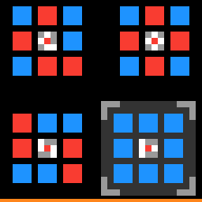

**Situation.** Three solved tile examples surround a bracketed puzzle. Small markers have colored centers and different border colors.

**Working hypothesis.** The examples encode constraints: a white border wants the adjacent tile to match the center, while gray wants a different color.

**Action.** Compare the examples, then click the corresponding tiles in the bracketed puzzle to cycle their colors.

**Expected result.** I expect the chosen tiles to satisfy the marker's match and non-match conditions, and the level to advance when all conditions hold.

**Result.** The marker rules apply in all eight neighboring directions, and the game checks all markers together after a tile change.

**Revised understanding.** The small marker is a local instruction, not another tile to color. Shared tiles must satisfy every marker that refers to them.

**Next move.** Read each marker before clicking and resolve shared-tile constraints before spending clicks on later boards.

**Reconstruction:** action inferred_from_game_evidence; expectation inferred_from_game_evidence; result mechanics_reconstruction.

**Executable example:** [verified replay transitions](evidence/ft09.transitions.jsonl.gz), level 1, 4 actions. Filter by the level field; the final transition records the clear.

## Ghost Twin (g50t)

[Game write-up](https://arc3.markbarney.net/arc3/games/g50t)

### Level 1 — g50t:ca96ffc990dbe334

**Source note:** You move to where you want your ghost twin to go, then press spacebar. You get sent back to where you started, and a ghost twin walks the exact path you just walked. You get three ghost twins. It works, but it is weird. If you have never seen it before it just does not make sense, and it would never occur to a lot of people. He thinks many players get frustrated and leave. He won it twice (13 and 15 Sep, 7/7 both times, 533 and 536 actions). The public top 10 all won in 274-323 actions, against ARC's average of 879.

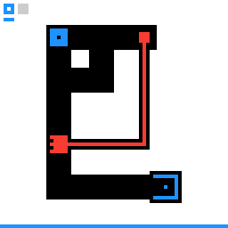

**Situation.** Moving through the corridor records a path. Pressing spacebar returns me to the start and creates a second moving figure.

**Working hypothesis.** The second figure replays my path, so it can occupy a control while I take a different route.

**Action.** Walk the route needed to reach a pressure plate, press ACTION5 to create the twin, and move the live player toward the exit while the twin repeats it.

**Expected result.** I expect the twin's recorded motion to activate the plate or panel at the useful time.

**Result.** The player used the ghost twins to operate levers and panels while the live player reached the exit.

**Revised understanding.** I am programming another actor with my own movement history. Returning to the start is preparation for parallel execution.

**Next move.** Choose each recorded route for the control it must operate, then coordinate my next path with the twin's replay.

**Reconstruction:** action expanded_from_recorded_action; expectation inferred_from_game_evidence; result human_report.

**Executable example:** [verified replay transitions](evidence/g50t.transitions.jsonl.gz), level 1, 28 actions. Filter by the level field; the final transition records the clear.

### Level 1 — g50t:f22bfc11a3c79434

**Source note:** ACTION5. It is not rewind. It is what spawns the ghost twin.

**Situation.** ACTION5 sends the player back toward the start, which initially resembles an undo or rewind.

**Working hypothesis.** If it is a pure rewind, it should simply restore the earlier state. If it records a ghost, there should be a new actor repeating the previous route.

**Action.** Walk a recognizable short path and press ACTION5, then observe the extra figure while making a different move.

**Expected result.** I expect either a restored single-player state or two actors whose paths now diverge.

**Result.** A ghost twin repeats the recorded path. ACTION5 creates a replaying actor rather than merely undoing progress.

**Revised understanding.** The return to the start is only one part of the effect. The persistent twin is the useful mechanism.

**Next move.** Record a path with a purpose, such as holding a plate, before creating the next twin.

**Reconstruction:** action inferred_from_game_evidence; expectation inferred_from_game_evidence; result mechanics_reconstruction.

**Executable example:** [verified replay transitions](evidence/g50t.transitions.jsonl.gz), level 1, 28 actions. Filter by the level field; the final transition records the clear.

## Kick Away (ka59)

[Game write-up](https://arc3.markbarney.net/arc3/games/ka59)

### Level 1 — ka59:78ab66bc6223c02f

**Source note:** Pieces to push around, Sokoban-like. Pretty easy. It feels like kicking pieces away, which is where the name Kick Away comes from.

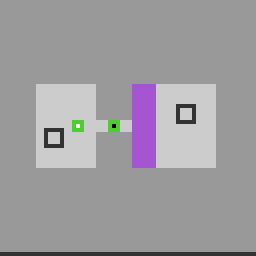

**Situation.** Green movable boxes, gray target frames and a purple strip suggest pushing, but the pieces can travel much farther than one ordinary step.

**Working hypothesis.** Driving into a neighboring piece may kick it away while my selected box stays put.

**Action.** Select a green box and drive it into a piece aligned with an available target.

**Expected result.** I expect the struck piece to move along that direction; I need to watch whether my selected box moves with it.

**Result.** The selected box stays put while the struck piece is propelled. A knocked piece can cross purple terrain that blocks the box being driven.

**Revised understanding.** The important distinction is controlled movement versus an impact-driven slide. I should line up the kick before using it.

**Next move.** Use walls and target size to plan where the kicked piece will stop, then position the selected box for the next impact.

**Reconstruction:** action inferred_from_game_evidence; expectation inferred_from_game_evidence; result mechanics_reconstruction.

**Executable example:** [verified replay transitions](evidence/ka59.transitions.jsonl.gz), level 1, 25 actions. Filter by the level field; the final transition records the clear.

## Leapfrog (lf52)

[Game write-up](https://arc3.markbarney.net/arc3/games/lf52)

### Level 2 — lf52:bf9fc7ed4264ac78

**Source note:** Undo (ACTION7) is available. Undo is load-bearing here: one of three public games (with bp35 and sk48) where you realistically need it to finish, not a convenience.

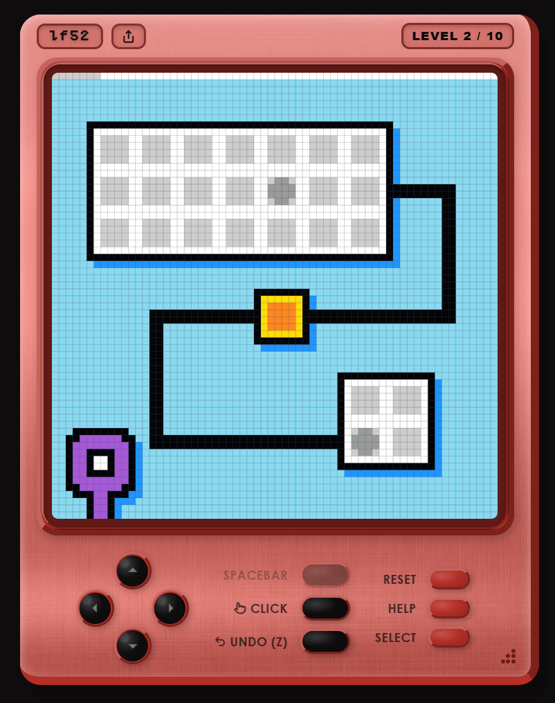

**Situation.** A legal hop removes a peg, but it can leave the remaining pegs unable to interact. ACTION7 is available.

**Working hypothesis.** A locally successful capture may still make the board unsolvable. Undo should let me return to the decision before that capture.

**Action.** Make a candidate hop, inspect the remaining legal landings and undo if the move isolates a needed peg.

**Expected result.** I expect the captured peg and previous positions to return so I can choose another branch.

**Result.** The game's Undo restores the preceding action and refunds its move cost. This supports the player's account that Undo is central to solving later boards.

**Revised understanding.** I can search by testing a move and inspecting its consequences, preserving correct earlier moves instead of restarting the whole level.

**Next move.** Try a different hop whose landing keeps the remaining pegs connected to future captures.

**Reconstruction:** action inferred_from_game_evidence; expectation inferred_from_game_evidence; result mechanics_reconstruction.

**Executable example:** [verified replay transitions](evidence/lf52.transitions.jsonl.gz), level 2, 44 actions. Filter by the level field; the final transition records the clear.

### Level 3 — lf52:a3c2dbf047699031

**Source note:** Ten levels, each needing a lot more clicks than the last. It is much more than peg solitaire. The later levels get bigger budgets because they take far more clicks. On the human leaderboard the gap between #1 and #10 is hundreds of actions, and a player without the right idea in the first couple of moves falls apart.

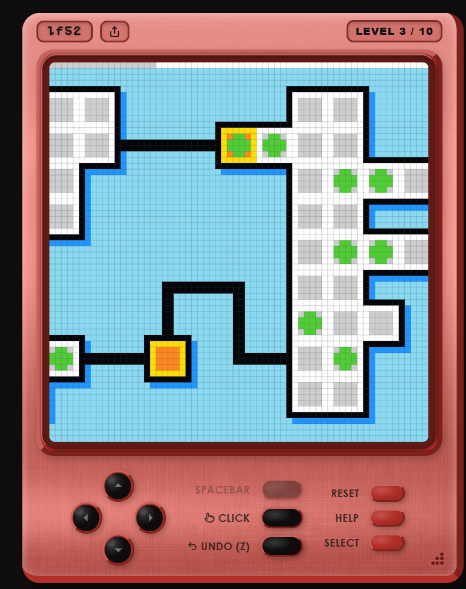

**Situation.** The later board spans rooms joined by rail carts. Removing pegs is only part of the work; pegs must be transported between useful positions.

**Working hypothesis.** The puzzle may require preserving a peg as a passenger or future jumping support rather than taking every available capture immediately.

**Action.** Inspect the intended next room and move the cart carrying a useful peg before committing to a capture that would remove it.

**Expected result.** I expect the transported peg to create a legal jump that does not exist in the starting room.

**Result.** Cart transport and scrolling are part of the later game. This explains why the player's experience was more involved than isolated peg solitaire.

**Revised understanding.** The first few captures can destroy resources needed much later. I need a transport plan as well as a capture plan.

**Next move.** Work backward from the final pair of pegs and preserve the cart access needed to bring them together.

**Reconstruction:** action inferred_from_game_evidence; expectation inferred_from_game_evidence; result mechanics_reconstruction.

**Executable example:** [verified replay transitions](evidence/lf52.transitions.jsonl.gz), level 3, 46 actions. Filter by the level field; the final transition records the clear.

### Level 1 — lf52:7704f85381680316

**Source note:** Level 1. It should take no more than 10 actions. He believes it can be done in 3.

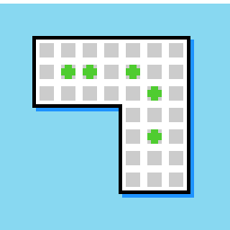

**Situation.** Five green pegs occupy the opening board. I suspect the small board should have a very short solution.

**Working hypothesis.** Each same-color hop removes one peg, so reaching one peg requires four captures. Three total actions cannot remove four pegs here.

**Action.** Choose a peg with a legal landing, click its landing to capture, and continue a sequence that leaves another capture available.

**Expected result.** I expect four successful hops to reduce five pegs to one; selecting and landing also require separate clicks.

**Result.** The checked rules and the winning demonstration clear this board with four hops. The player's suggested three-action solution is not supported by this starting layout.

**Revised understanding.** I should distinguish a hop from an input and test an efficiency estimate against the actual number of pieces that must disappear.

**Next move.** Use the short verified demonstration to study a four-hop route rather than treating the speculative three-action estimate as a target.

**Reconstruction:** action inferred_from_game_evidence; expectation inferred_from_game_evidence; result mechanics_reconstruction.

**Executable example:** [verified replay transitions](evidence/lf52.transitions.jsonl.gz), level 1, 9 actions. Filter by the level field; the final transition records the clear.

### Level 2 — lf52:49a8231399e7fa02

**Source note:** A car on the board. You move the car with the direction keys. The AI runs never realize that, so they never solve level 2.

**Situation.** An orange car sits on black track lines beside the peg board. Clicking alone does not explain how to reposition it.

**Working hypothesis.** The arrow keys may control this new object even though they were useless on level 1.

**Action.** Press a direction along the visible track and watch the cart rather than the pegs.

**Expected result.** I expect the cart to move one track square, carrying any peg positioned on it.

**Result.** The cart moves under the arrow keys. This supplies the missing transport control that the player identified in level 2.

**Revised understanding.** I need to retest previously unhelpful controls when a level introduces a new object.

**Next move.** Align the cart with the board so a peg can hop on or off, then transport that peg toward another useful landing.

**Reconstruction:** action inferred_from_game_evidence; expectation inferred_from_game_evidence; result mechanics_reconstruction.

**Executable example:** [verified replay transitions](evidence/lf52.transitions.jsonl.gz), level 2, 44 actions. Filter by the level field; the final transition records the clear.

### Level 3 — lf52:77bbd7c62cb9377f

**Source note:** Level 3. Everything is side-scrolling: you have to go way off the original screen. It is like bp35, except bp35 scrolls up and down and this one scrolls sideways.

**Situation.** The cart and track approach the edge of the screen, and the visible pegs do not appear to form a complete solvable board.

**Working hypothesis.** The screen is a window into a wider level. Transporting a green peg may move the view and reveal the missing room.

**Action.** Put a green peg on the cart and drive it along the track beyond the original viewport.

**Expected result.** I expect the camera to follow and expose more floor or pegs rather than treat the screen edge as a wall.

**Result.** The level scrolls sideways; the player's capture shows track and rooms extending beyond the original view.

**Revised understanding.** I need a map of the world, including off-screen rooms. A peg's usefulness cannot be judged only from the current viewport.

**Next move.** Record the new room's landing tiles and decide where the cart should carry the peg next.

**Reconstruction:** action inferred_from_game_evidence; expectation inferred_from_game_evidence; result human_report.

**Executable example:** [verified replay transitions](evidence/lf52.transitions.jsonl.gz), level 3, 46 actions. Filter by the level field; the final transition records the clear.

## Loop and Pull (lp85)

[Game write-up](https://arc3.markbarney.net/arc3/games/lp85)

### Level 1 — lp85:07f114b1b012278a

**Source note:** The tiny yellow boxes. They show where it wants the yellow box. You are looping, and once you see that it is loop and pull, that is the whole game; it only gets more complex with the pulleys. One of the original preview games, and easy for him now.

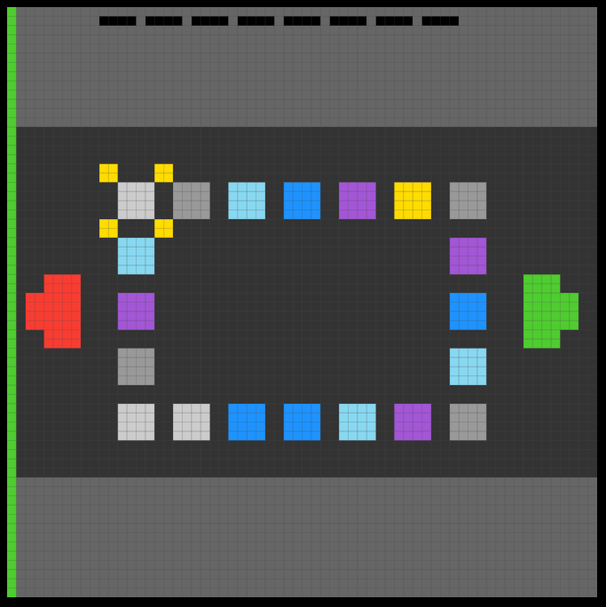

**Situation.** A yellow square sits among a loop of other colors, while four tiny yellow corner dots frame another slot.

**Working hypothesis.** The corner dots are a destination, and the red and green buttons move the whole loop in opposite directions.

**Action.** Click the red loop button and follow the yellow square by one slot; continue around the loop toward the framed slot.

**Expected result.** I expect the target dots to stay fixed while the yellow square moves with all the loop's other squares.

**Result.** The loop moves one slot backward per red click and wraps at its end. A yellow square occupying the framed target satisfies it.

**Revised understanding.** The goal marker and the carried squares belong to different layers. I can count loop steps instead of interpreting every color as a separate objective.

**Next move.** Choose the shorter direction for this loop; on later boards, use shared slots to transfer a yellow square between loops.

**Reconstruction:** action inferred_from_game_evidence; expectation inferred_from_game_evidence; result mechanics_reconstruction.

**Executable example:** [verified replay transitions](evidence/lp85.transitions.jsonl.gz), level 1, 7 actions. Filter by the level field; the final transition records the clear.

## Locksmith (ls20)

[Game write-up](https://arc3.markbarney.net/arc3/games/ls20)

### Level 2 — ls20:a08a9e3e0e8ede24

**Source note:** Three red dots: your lives on each level. Every death costs one. Reset brings all three back. So on some levels, especially the last one, where you can easily run out of time, you want to reset rather than lose the game. Undo isn't available in the current version; reset is. He found the reset rules bizarre when the preview came out, and this is probably why agents do so badly here: they don't use reset to keep their lives.

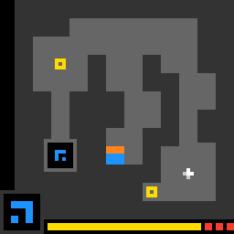

**Situation.** The red life dots are running down, and the current route is unlikely to reach the door before the meter expires.

**Working hypothesis.** Reset may restore the level's resources, allowing me to retry a better route without losing the whole run.

**Action.** Use RESET before spending the final life, then compare the life dots, meter, key and pickups with their starting state.

**Expected result.** I expect a fresh local attempt, including restored lives, in exchange for losing progress within this level.

**Result.** The player reports all three lives returning. Reset also restores the starting key, pickups, doors and meter.

**Revised understanding.** Reset is a resource-management action. It can protect the run when my current route is already unproductive.

**Next move.** Replay the useful route knowledge with fewer wasted moves, collecting only the transformations needed for this lock.

**Reconstruction:** action expanded_from_recorded_action; expectation inferred_from_game_evidence; result human_report.

**Executable example:** [verified replay transitions](evidence/ls20.transitions.jsonl.gz), level 2, 45 actions. Filter by the level field; the final transition records the clear.

### Level 1 — ls20:ded6ddc0192584d8

**Source note:** Lots of energy and three lives. Room for a lot of exploration.

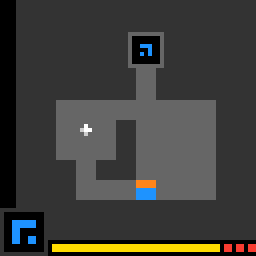

**Situation.** A large movement meter and three life dots make the opening layout appear forgiving enough to explore.

**Working hypothesis.** I can spend an early attempt learning what a special tile does to the key, then use that knowledge on a more direct route.

**Action.** Walk onto a transformation tile and compare the key display with the shape shown at the door.

**Expected result.** I expect the tile to change one relevant property of the key and the meter to reveal the cost of reaching it.

**Result.** The game's key changes through special tiles, while movement spends the meter. Later levels can drain it faster, so the apparent freedom of the opening level does not generalize.

**Revised understanding.** Exploration is useful when it answers a specific key-transformation question. Having three lives does not make every detour affordable.

**Next move.** Plan the remaining shape, rotation and color changes before taking the key to the door.

**Reconstruction:** action inferred_from_game_evidence; expectation inferred_from_game_evidence; result mechanics_reconstruction.

**Executable example:** [verified replay transitions](evidence/ls20.transitions.jsonl.gz), level 1, 15 actions. Filter by the level field; the final transition records the clear.

### Level 1 — ls20:0752cd367a3b8006

**Source note:** The ls20 from the preview. Today's ls20 is fundamentally a different game. Replays from before September don't reflect it.

**Situation.** The current Locksmith screen and rules differ from the preview version I remember.

**Working hypothesis.** My old route or recovery assumptions may refer to another build. I should identify the current controls and objective before reusing an old replay.

**Action.** Compare the current key, lock, transformation tiles and RESET behavior with the current-build demonstration.

**Expected result.** I expect a current solution to respect the present key transformations and life system even where an old demonstration does not.

**Result.** The current registry documents a reworked game; the player explicitly reports that pre-September replays do not describe today's version.

**Revised understanding.** A replay is only useful if it belongs to the right game build. Familiar appearance is not enough to transfer a solution.

**Next move.** Use the recorded current-build action sequence as the reference and relearn any mechanics that differ from memory.

**Reconstruction:** action inferred_from_game_evidence; expectation inferred_from_game_evidence; result human_report.

**Executable example:** [verified replay transitions](evidence/ls20.transitions.jsonl.gz), level 1, 15 actions. Filter by the level field; the final transition records the clear.

## Mirror Rendezvous (m0r0)

[Game write-up](https://arc3.markbarney.net/arc3/games/m0r0)

### Level 1 — m0r0:1457c955778fde9a

**Source note:** Two twins sliding around, a bit like the old as66. One of the simplest games and easiest wins: you slide around and try to meet up with your twin. Models don't seem to have much trouble with it either.

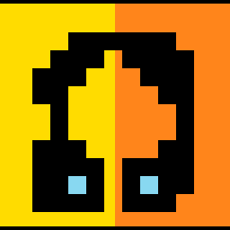

**Situation.** Two tokens respond together, with horizontal motion mirrored. Simply steering them toward each other preserves an awkward separation.

**Working hypothesis.** If I move one token into a wall while the other remains free, the wall should break their symmetry.

**Action.** Steer until one token is blocked, then continue the same input while watching the other token's position.

**Expected result.** I expect only the unblocked token to move, changing their relative alignment.

**Result.** The movement rule allows one twin to be stopped by terrain while the other moves. Repeating that maneuver permits both to occupy the same tile.

**Revised understanding.** The walls are alignment tools, not just obstacles. I should reason about the two tokens' relative positions.

**Next move.** Use another asymmetric collision to remove the remaining offset, then guide both to the meeting tile.

**Reconstruction:** action inferred_from_game_evidence; expectation inferred_from_game_evidence; result mechanics_reconstruction.

**Executable example:** [verified replay transitions](evidence/m0r0.transitions.jsonl.gz), level 1, 15 actions. Filter by the level field; the final transition records the clear.

### Level 2 — m0r0:4c64db2755cade58

**Source note:** Solid red areas, and dashed red-and-black ones. Solid red is fine; the dashed red-and-black areas are traps that send you back to the start. They only show up on levels 2, 4 and 6, and red and black are harmless everywhere else, which will confuse anything that relies on measuring pixel colors.

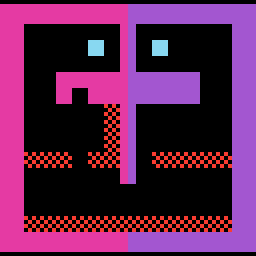

**Situation.** Some red regions are solid color and others have a red-and-black pattern. Their different textures may indicate different behavior.

**Working hypothesis.** I should not generalize danger from the color red alone; the patterned area may be the actual trap.

**Action.** Track the result when a twin enters a patterned tile and compare it with travel through an ordinary red region.

**Expected result.** I expect a dangerous pattern to produce a reset or penalty while an ordinary red region remains traversable.

**Result.** The patterned trap flashes and returns both twins to their starts; already spent actions remain spent. Solid red regions are harmless in the player's account.

**Revised understanding.** The relevant visual feature is the pattern, and trap recovery does not replenish the move budget.

**Next move.** Plan around the patterned cells while still using harmless red terrain where it helps align the twins.

**Reconstruction:** action inferred_from_game_evidence; expectation inferred_from_game_evidence; result human_report.

**Executable example:** [verified replay transitions](evidence/m0r0.transitions.jsonl.gz), level 2, 23 actions. Filter by the level field; the final transition records the clear.

## Reaching Lurch (r11l)

[Game write-up](https://arc3.markbarney.net/arc3/games/r11l)

### Level 5 — r11l:34d2b7be4035b881

**Source note:** A blob with limbs, food pellets, and a colored gate. It is an amoeba. You can't move the body directly; it always re-centers between the limbs. The body itself has to be over a pellet to eat it, and dragging a limb over a pellet does nothing. Eating changes the body's color, which is what gets it through the gate.

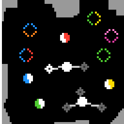

**Situation.** The blob has movable limbs, a central body, food and colored targets. Moving a limb over food is not making it disappear.

**Working hypothesis.** The body may be the part that eats. Moving a limb might only pull the body indirectly toward the new balance point.

**Action.** Move a limb so the body's new center passes over a pellet, then compare with a move where only the limb crosses it.

**Expected result.** I expect the pellet to be eaten only when the body overlaps it, and eating should change the body's color.

**Result.** The player reports exactly that distinction: the body re-centers between limbs, and the body itself must cover the food.

**Revised understanding.** I control the body through the limbs. The path of the clicked limb is not the path that matters for collection.

**Next move.** Choose limb positions that carry the body over the required colors and then place the colored body on its matching outline.

**Reconstruction:** action expanded_from_recorded_action; expectation inferred_from_game_evidence; result human_report.

**Executable example:** [verified replay transitions](evidence/r11l.transitions.jsonl.gz), level 5, 17 actions. Filter by the level field; the final transition records the clear.

### Level 5 — r11l:ff7bad09222c9385

**Source note:** Level 5. Hard to tell what it wants. On the first levels the body is already the target color; from here you have to eat pellets to make it the right color or combination of colors.

**Situation.** Several bodies and pellets appear with differently colored outlines. Unlike the early levels, the bodies do not already match their targets.

**Working hypothesis.** Position alone is insufficient now. I may need to change each body's color by eating before placing it.

**Action.** Guide a body's center over a chosen pellet and compare its new color with the target outline.

**Expected result.** I expect the pellet to change the body, making a previously wrong-colored body suitable for one of the outlines.

**Result.** The later-level goal requires the right color or combination; the player's note identifies eating as the new prerequisite.

**Revised understanding.** I need to solve a color-acquisition problem before the final placement problem.

**Next move.** Match each body to a feasible target color and plan a collection route that does not consume an unneeded pellet.

**Reconstruction:** action inferred_from_game_evidence; expectation inferred_from_game_evidence; result mechanics_reconstruction.

**Executable example:** [verified replay transitions](evidence/r11l.transitions.jsonl.gz), level 5, 17 actions. Filter by the level field; the final transition records the clear.

## Reach Emblems (re86)

[Game write-up](https://arc3.markbarney.net/arc3/games/re86)

### Level 1 — re86:b7e8cb733093726d

**Source note:** What to do is pretty obvious. It is just fiddly. He hasn't played it through, and hates games like this one.

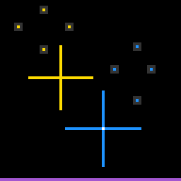

**Situation.** Yellow and blue outline crosses share the board with small dots of the same colors. Their interiors are mostly empty.

**Working hypothesis.** The objective likely checks colored pixels on the outlines, not whether a dot lies anywhere inside a piece's bounding box.

**Action.** Slide the selected yellow cross until its lines cover the yellow dot centers, then cycle to the blue piece and align its lines.

**Expected result.** I expect a dot inside an empty part of the outline to remain unsatisfied, even if the overall shape seems close enough.

**Result.** The code checks the colored center pixel against the piece visible there. Thin outlines require exact alignment; the selected piece's white center can also leave a dot uncovered.

**Revised understanding.** The game is fiddly because visual enclosure is not coverage. I need to check the actual colored lines at every target.

**Next move.** After aligning the pieces, switch selection if a white selection marker is masking a target, and check any remaining uncovered dot.

**Reconstruction:** action inferred_from_game_evidence; expectation inferred_from_game_evidence; result mechanics_reconstruction.

**Executable example:** [verified replay transitions](evidence/re86.transitions.jsonl.gz), level 1, 20 actions. Filter by the level field; the final transition records the clear.

## Sliding Indicator (s5i5)

[Game write-up](https://arc3.markbarney.net/arc3/games/s5i5)

### Level 5 — s5i5:b44e9f458a7808aa

**Source note:** On level 5 the buttons had obviously changed from level 4, and something else had changed too. It made no sense: most clicks moved nothing. The buttons are only smaller versions of the same grow/shrink sliders (right half grows, left half shrinks). What changed is that the orange and green buttons each drive two rods in different parts of the board, and any click that would make any rod hit something is cancelled while still costing a click. The level also starts with the light blue marker already on its pin, and that rod is in the way -- it has to be pulled off its pin and put back at the end.

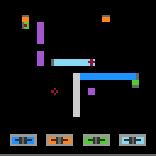

**Situation.** The smaller buttons resemble earlier grow/shrink controls, but most clicks appear to do nothing. A light blue marker already sits on its pin.

**Working hypothesis.** I initially think the new button shapes may mean new controls. Another possibility is that coupled rods or collisions cancel otherwise familiar moves.

**Action.** Try the slider halves while tracking every rod of the same color, then shrink the light blue rod away from its apparently completed pin.

**Expected result.** I expect a legal click to move all linked rods; clearing the light blue obstruction should enable moves that previously failed.

**Result.** The buttons still grow and shrink. Orange and green each control two rods, and a collision cancels the entire change while still costing a click. The light blue rod has to move away and be restored later.

**Revised understanding.** An apparently solved part can block the rest. I should optimize the whole board rather than preserve every completed marker.

**Next move.** Clear the shared rods' paths, solve their dependencies and restore light blue to its pin at the end.

**Reconstruction:** action expanded_from_recorded_action; expectation inferred_from_game_evidence; result human_report.

**Executable example:** [verified replay transitions](evidence/s5i5.transitions.jsonl.gz), level 5, 30 actions. Filter by the level field; the final transition records the clear.

### Level 6 — s5i5:65309e9ca16ab4b3

**Source note:** The rotate button looks like a cross or a plus sign. The write-up had called it a diamond. It is a plus; the hollow diamonds on the board are the pins you are aiming for.

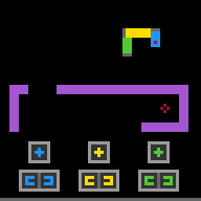

**Situation.** A plus-shaped control appears beside the color sliders, while hollow diamonds remain on the board.

**Working hypothesis.** The plus is probably the new rotation control; the diamonds are targets, not buttons.

**Action.** Click the plus for a rod color and track the rod's anchor and direction.

**Expected result.** I expect a quarter-turn around the anchor rather than a change in length or movement toward the diamond.

**Result.** The plus rotates every rod of its color counterclockwise. These controls appear from level 6.

**Revised understanding.** I can now change orientation and length separately, but one control can affect several rods.

**Next move.** Predict the swept geometry of all same-color rods before another rotation, then use sliders to bring their markers onto the pins.

**Reconstruction:** action inferred_from_game_evidence; expectation inferred_from_game_evidence; result mechanics_reconstruction.

**Executable example:** [verified replay transitions](evidence/s5i5.transitions.jsonl.gz), level 6, 25 actions. Filter by the level field; the final transition records the clear.

### Level 7 — s5i5:3927fe06c0286a07

**Source note:** After turning rods, the light blue rod had grown one segment too many. It did not: once a rod has been turned, shrinking it does not restore the earlier position, and he was left with a rod he could not fold into place. The undo key in the site player does nothing here -- RESET was the only way back.

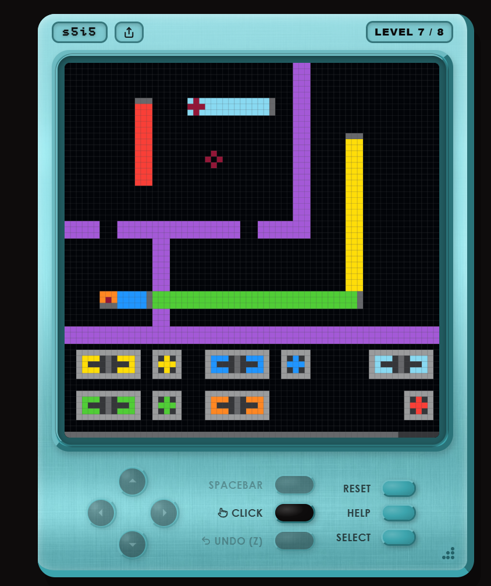

**Situation.** The light blue rod has been rotated and has grown one segment too far. The capture shows other rods constraining its space.

**Working hypothesis.** Shrinking might reverse the last growth, but it may not restore the earlier board geometry after the intervening rotation.

**Action.** Try the shrink control and compare the rod's resulting position with the position needed before the turn.

**Expected result.** I expect the earlier usable arrangement to return.

**Result.** It does not return to that arrangement. The player becomes stuck; the game supports only clicking and has no Undo, so RESET is the available recovery.

**Revised understanding.** A reverse-looking operation is not a reversal of the whole action sequence. I must track orientation, length and surrounding obstacles together.

**Next move.** Reset and change the sequence so the rod has the required length before the rotation that confines it.

**Reconstruction:** action expanded_from_recorded_action; expectation expanded_from_recorded_expectation; result human_report.

**Executable example:** [verified replay transitions](evidence/s5i5.transitions.jsonl.gz), level 7, 46 actions. Filter by the level field; the final transition records the clear.

### Level 7 — s5i5:50492cffb3a0ad45

**Source note:** Level 7: colored crosses and stiff arms. Demonic. You use the colored crosses to rotate the stiff arms, like an unfolding mechanical arm. He only got this far by watching GPT-6 Astra replays. It badly needs an undo, though undo might make it too easy: you can get completely stuck where only a reset gets you out, and with any exploration at all you will need reset on this level. A nightmare for his spatial reasoning.

**Situation.** Several long rods surround each other, and colored plus controls can rotate them. I reached this layout by following a successful replay.

**Working hypothesis.** Thinking of each rod independently is overwhelming. The replay may expose an order in which space is created for the next rod's turn.

**Action.** Pause before a replay rotation, identify the rod's anchor, and check which earlier shrink or move cleared its path.

**Expected result.** I expect a seemingly arbitrary earlier move to make room for the later rotation.

**Result.** The screenshot shows interlocking rods with different orientations; the game rejects colliding changes and has no Undo. The recorded winning sequence demonstrates an order that resolves those dependencies.

**Revised understanding.** The replay is useful as a dependency lesson: clear space, set length, rotate, then restore displaced pieces.

**Next move.** Reconstruct the next rotation from the space it requires rather than copying several inputs without checking the intermediate layout.

**Reconstruction:** action inferred_from_game_evidence; expectation inferred_from_game_evidence; result mechanics_reconstruction.

**Executable example:** [verified replay transitions](evidence/s5i5.transitions.jsonl.gz), level 7, 46 actions. Filter by the level field; the final transition records the clear.

## Sequence Belt (sb26)

[Game write-up](https://arc3.markbarney.net/arc3/games/sb26)

### Level 1 — sb26:eaf316f597073df1

**Source note:** The row across the top is showing you an order it wants to see the colored boxes in. That is pretty much all it is, and then it is abstractions: "here is what I want, and I am going to read the band like this." It is incredibly easy once you see that. He likens it to a coded band rather than a sorting band -- writing out old computer code on punch cards, where the card holds the instruction and the reader decides how the card gets read. The same framing he used on TR87: "the game asks you for a certain code," only with colors instead of runes.

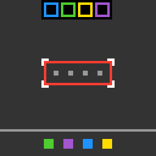

**Situation.** The top row gives a color sequence, and a marked machine has empty slots above a tray of colored tiles.

**Working hypothesis.** The machine reads a sequence of instructions; the spatial arrangement matters because a reader traverses it in a fixed order.

**Action.** Place colors into the machine slots in the required order and run the machine, watching which slot is read next.

**Expected result.** I expect the emitted colors to match the top row from left to right.

**Result.** The reader starts at the leftmost slot of the white-marked machine and reads right. Later colored rings call another machine's sequence and return afterward.

**Revised understanding.** The board is a small program. I need to simulate its reading order, including nested calls, rather than merely group matching colors.

**Next move.** Before another run, write out the expanded color sequence and compare it with the requested row.

**Reconstruction:** action expanded_from_recorded_action; expectation inferred_from_game_evidence; result mechanics_reconstruction.

**Executable example:** [verified replay transitions](evidence/sb26.transitions.jsonl.gz), level 1, 9 actions. Filter by the level field; the final transition records the clear.

### Level 1 — sb26:1503d15d73db4d3b

**Source note:** The colored boxes and the band. Once you see it is like an extraction code, it is pretty easy; the hardest part is working out which colors go where. He lost one run by pressing reset twice by accident, which sends you back to level 1. Reset is a double-edged sword.

**Situation.** I can interpret the colored band, but I am tempted to press Reset again after an accidental reset.

**Working hypothesis.** A second reset may have a broader effect than correcting one misplaced tile.

**Action.** Inspect the level and board after the first reset; the reported incident then includes a second accidental press.

**Expected result.** I would expect to stay near my current puzzle if Reset only cleared its arrangement.

**Result.** The player reports being sent back to level 1 after pressing Reset twice.

**Revised understanding.** I must observe the state after a recovery action before repeating it. The sequence task is easy to understand, but recovery can erase substantial progress.

**Next move.** Rebuild the known sequence deliberately and use direct tile corrections where possible instead of repeating Reset blindly.

**Reconstruction:** action inferred_from_game_evidence; expectation inferred_from_game_evidence; result human_report.

**Executable example:** [verified replay transitions](evidence/sb26.transitions.jsonl.gz), level 1, 9 actions. Filter by the level field; the final transition records the clear.

## Sigil Caster (sc25)

[Game write-up](https://arc3.markbarney.net/arc3/games/sc25)

### Level 1 — sc25:5fac0c6b979e7b17

**Source note:** The game as a whole. He would never have figured it out and had to cheat. Once you understand it is showing you a spell to cast, it is obvious.

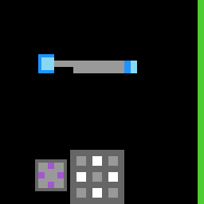

**Situation.** A wizard faces a narrow passage. A small icon and a three-by-three dot grid sit below the board, and the opening action demonstrates a pattern.

**Working hypothesis.** The dots may encode a spell. The icon could be a recipe, and changing size would explain how to pass the narrow section.

**Action.** After the opening demo, reproduce the grow/shrink sigil by lighting the four dots around the center and leaving the center off.

**Expected result.** I expect the exact pattern to cast automatically and shrink the large wizard.

**Result.** The matching sigil triggers the size spell and clears the grid. A small wizard can then use the narrow passage.

**Revised understanding.** The interface is showing me a spell to draw, not a separate board to solve by moving the wizard onto it.

**Next move.** Move through the opening while small, then inspect the available spell icons before using later teleport or fireball mechanics.

**Reconstruction:** action inferred_from_game_evidence; expectation inferred_from_game_evidence; result mechanics_reconstruction.

**Executable example:** [verified replay transitions](evidence/sc25.transitions.jsonl.gz), level 1, 23 actions. Filter by the level field; the final transition records the clear.

## Skewer Kebabs (sk48)

[Game write-up](https://arc3.markbarney.net/arc3/games/sk48)

### Level 2 — sk48:47710b3e79c1a661

**Source note:** Undo (ACTION7) is available. Undo is load-bearing here: one of three public games (with bp35 and lf52) where you realistically need it to finish, not a convenience.

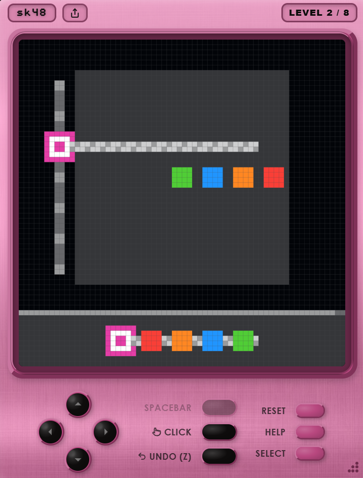

**Situation.** I can get a bead onto the rod in the wrong order, and the reference still demands a different color sequence.

**Working hypothesis.** Undo should restore the physical arrangement before the bad extension without making me replay the entire level.

**Action.** Press ACTION7 after an extension or slide that traps the wrong bead.

**Expected result.** I expect the beads and rods to return to the last changed state, allowing a different approach.

**Result.** The game's Undo restores the last state-changing move and is free, but it does not replenish energy already spent.

**Revised understanding.** I can recover geometry while still consuming my finite exploration budget. Undo is essential but not unlimited free search.

**Next move.** Use the restored position to set up the correct bead order before extending again.

**Reconstruction:** action inferred_from_game_evidence; expectation inferred_from_game_evidence; result mechanics_reconstruction.

**Executable example:** [verified replay transitions](evidence/sk48.transitions.jsonl.gz), level 2, 34 actions. Filter by the level field; the final transition records the clear.

### Level 2 — sk48:d5ac8e0cb8add2d9

**Source note:** The skewers at the bottom of the screen show the order the colored boxes are wanted in. It is an extendable meat skewer and the boxes are pieces of meat going onto it in a set order. It is physics: you can't just get up close to a box, you have to push it against the wall and spear it. Once speared it comes along with you on the rod, and it is solid, so you can use it to push the other boxes down.

**Situation.** A horizontal skewer points toward loose colored beads, and the bottom reference orders the colors outward from the handle.

**Working hypothesis.** Simply touching a bead may push it. To spear it, I may need to stop it against the wall or another immovable bead.

**Action.** Extend toward the required bead, keep pushing until it is blocked, and extend the rod through it; then retract or slide to test attachment.

**Expected result.** I expect a blocked bead to stay in place while the tip passes through it, after which the bead should travel with the rod.

**Result.** The player reports that pinning the bead is what allows skewering. Attached beads ride with the rod and can push other beads.

**Revised understanding.** The physical distinction between pushing and piercing explains the order problem. I need a backstop, not just proximity.

**Next move.** Arrange the next desired color against a stop while keeping already skewered colors in the correct order.

**Reconstruction:** action expanded_from_recorded_action; expectation inferred_from_game_evidence; result human_report.

**Executable example:** [verified replay transitions](evidence/sk48.transitions.jsonl.gz), level 2, 34 actions. Filter by the level field; the final transition records the clear.

### Level 4 — sk48:f15190b1de11264a

**Source note:** Level 4 starts with pieces already on the skewers. The meat-skewer picture still explains it. The AI runs he read had called the rod a pen or a snake's tongue, and none of their guesses would handle this level.

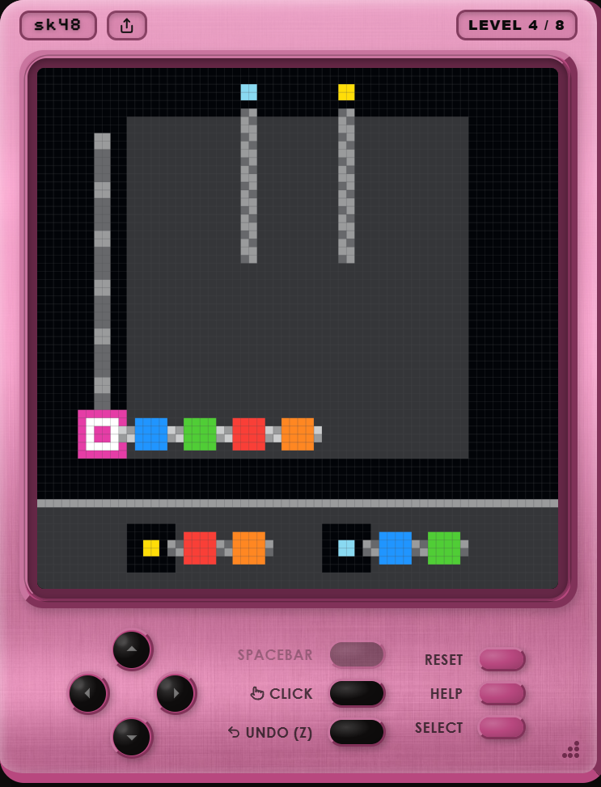

**Situation.** Beads already occupy rods, and multiple references appear below. The controlled rod's arrangement does not simply need to match another working rod.

**Working hypothesis.** The references specify the desired states of particular rods, including fixed ones. Existing attachments may need to be rearranged or delivered.

**Action.** Match reference handles to the rods they describe, then use the controlled skewer to move beads toward the appropriate fixed rod.

**Expected result.** I expect a transferred bead to count for the rod whose reference requires its color, rather than require every rod to become identical.

**Result.** The level begins with attached beads and several reference arrangements. The same skewer mechanics still explain attachment and rearrangement.

**Revised understanding.** I should read the target configuration per rod before moving existing beads. A bead already attached somewhere is not necessarily finished.

**Next move.** Compare the next missing reference color with the available beads and plan how the moving skewer can position it.

**Reconstruction:** action inferred_from_game_evidence; expectation inferred_from_game_evidence; result mechanics_reconstruction.

**Executable example:** [verified replay transitions](evidence/sk48.transitions.jsonl.gz), level 4, 49 actions. Filter by the level field; the final transition records the clear.

### Level 5 — sk48:d7a51bb2245abaf3

**Source note:** A black box blocks the skewer, with red boxes behind it. Clicking changed nothing. He worked the level out by experimenting.

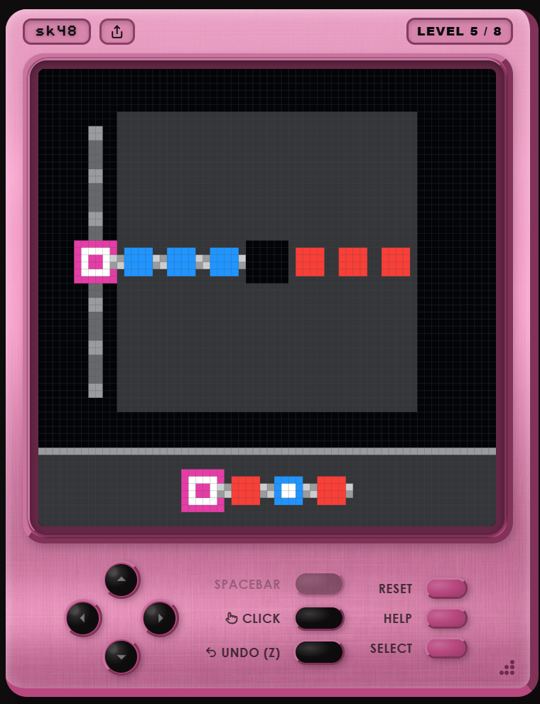

**Situation.** A black wall blocks direct extension, with red beads beyond it. Clicking the wall and nearby pieces seems like a possible interaction.

**Working hypothesis.** Perhaps clicking removes or selects the obstruction; if clicks do nothing, the solution must use skewer motion around a fixed wall.

**Action.** Click around the obstruction, then switch to examining how sliding and retracting can change the approach.

**Expected result.** I initially expect clicking to change something.

**Result.** Clicking changes nothing. The wall is solid, and this level has only one controllable rod; clicks only become useful for switching rods when a second one appears.

**Revised understanding.** The obstruction is a geometric constraint, not an interactive button. Random clicks cannot reveal a function this level does not provide.

**Next move.** Move the rod along its rail to manipulate beads from another row and use retraction to change which beads remain attached.

**Reconstruction:** action expanded_from_recorded_action; expectation expanded_from_recorded_expectation; result human_report.

**Executable example:** [verified replay transitions](evidence/sk48.transitions.jsonl.gz), level 5, 117 actions. Filter by the level field; the final transition records the clear.

### Level 6 — sk48:f68523801ff68215

**Source note:** Level 6, right before the win. Each skewer is matched to its own reference at the bottom. They are not always pairs of skewers, and a skewer does not have to match a partner.

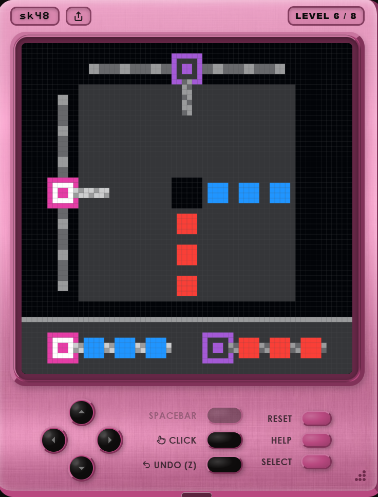

**Situation.** The nearly solved capture has pink and purple skewers carrying different colors, with a separate reference for each handle.

**Working hypothesis.** The goal compares each skewer with its own reference, so making the working rods identical would undo correct progress.

**Action.** Read outward from each handle and compare those colors with the reference of the same handle color.

**Expected result.** I expect pink's blue sequence and purple's red sequence to be checked independently.

**Result.** The screenshot shows the distinct sequences, and the player's account confirms that a skewer need not match a partner. The goal tests reference positions per rod.

**Revised understanding.** I need two simultaneous target matches, not equality between rods.

**Next move.** Keep the already correct rod intact while adjusting only the remaining mismatch on the other one.

**Reconstruction:** action inferred_from_game_evidence; expectation inferred_from_game_evidence; result human_report.

**Executable example:** [verified replay transitions](evidence/sk48.transitions.jsonl.gz), level 6, 83 actions. Filter by the level field; the final transition records the clear.

### Level 6 — sk48:fffe374fbbf693f8

**Source note:** Two skewers to work with, pink and purple, and each one wants different colors. Clicking does nothing in this game until level 6 of 8. From there it is how you switch skewers.

**Situation.** Two controllable skewers now appear, pink and purple, each with a different reference. Earlier clicks seemed useless.

**Working hypothesis.** Clicking may now choose which rod responds, rather than alter beads or walls.

**Action.** Click the purple handle or its reference, then make a directional move and watch which rod moves.

**Expected result.** I expect the white selection indicator and movement control to transfer from pink to purple.

**Result.** The player confirms that clicking switches skewers from level 6 onward. Before this level there was only one controllable rod to select.

**Revised understanding.** A control can gain a meaningful role when the set of objects changes. Earlier no-ops do not prove that clicking is permanently irrelevant.

**Next move.** Select the rod whose reach and reference matter for the next bead, then switch back when coordination requires it.

**Reconstruction:** action expanded_from_recorded_action; expectation inferred_from_game_evidence; result human_report.

**Executable example:** [verified replay transitions](evidence/sk48.transitions.jsonl.gz), level 6, 83 actions. Filter by the level field; the final transition records the clear.

### Level 7 — sk48:9e49a45db72de176

**Source note:** Pink and purple skewers, and both of them need green. Level 7 is insane: the two skewers have to work together because they share the green peas.

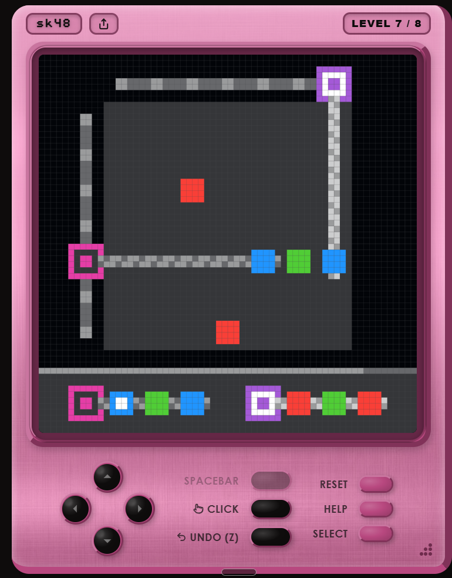

**Situation.** Pink's reference is blue–green–blue, purple's is red–green–red, and there is only one green bead on the board.

**Working hypothesis.** Both goals can be satisfied simultaneously only if the green bead belongs to both rods. Their intersection may allow that.

**Action.** Arrange the green bead at the crossing, put the two blue beads along pink and the red beads along purple, and extend pink to include its final blue bead.

**Expected result.** I expect the shared green to occupy the middle position when each rod is read outward from its own handle.

**Result.** The goal checker collects beads at each rod segment independently, so the crossing bead can count twice. The verified level-7 run clears on ACTION4 after 53 recorded actions.

**Revised understanding.** I do not need to create a second green or transfer it after one rod is finished. I need the intersection to satisfy both references at once.

**Next move.** Check the order from each handle and preserve the shared crossing while adjusting the remaining outer bead.

**Reconstruction:** action inferred_from_game_evidence; expectation inferred_from_game_evidence; result mechanics_reconstruction.

**Executable example:** [verified replay transitions](evidence/sk48.transitions.jsonl.gz), level 7, 53 actions. Filter by the level field; the final transition records the clear.

### Level 8 — sk48:c86d6bde82118ec9

**Source note:** The purple skewer can reach the bottom of the board; the pink one on the left can't. The fiendish part: you absolutely have to work with the other skewer to win level 8.

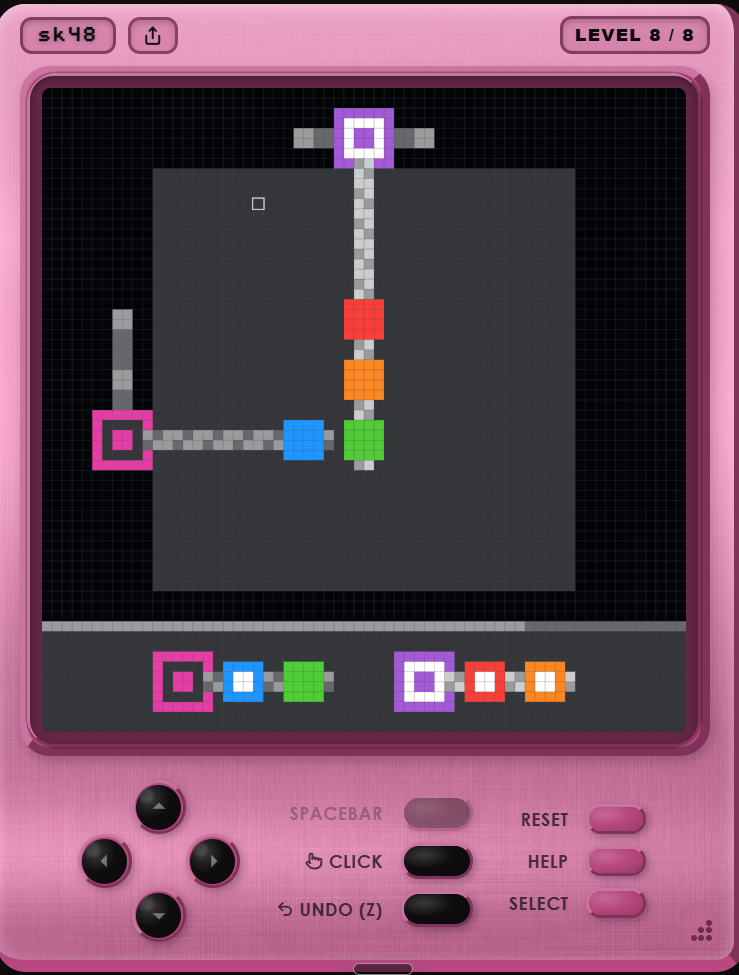

**Situation.** The pink rod has only two rail positions, while purple reaches down toward the green bead. Pink needs blue–green; purple needs red–orange.

**Working hypothesis.** Pink cannot fetch the low green itself. Purple must make that bead accessible even though green is not part of purple's required sequence.

**Action.** Use purple to bring the green into pink's reachable region, then coordinate the rods so pink keeps blue–green while purple carries red–orange.

**Expected result.** I expect purple's motion to solve a reachability problem for pink, after which both reference sequences can be satisfied.

**Result.** The short pink rail and low green start establish the dependency. The verified level-8 demonstration wins on ACTION2 after 47 recorded actions.

**Revised understanding.** The rods have different jobs during the solution from the colors they need at the end. A useful temporary attachment need not belong in that rod's final reference.

**Next move.** Finish the two reference prefixes without moving the green back out of pink's reach; beads beyond a required prefix need not prevent a win.

**Reconstruction:** action inferred_from_game_evidence; expectation inferred_from_game_evidence; result mechanics_reconstruction.

**Executable example:** [verified replay transitions](evidence/sk48.transitions.jsonl.gz), level 8, 47 actions. Filter by the level field; the final transition records the clear.

## Streaming Purple (sp80)

[Game write-up](https://arc3.markbarney.net/arc3/games/sp80)

### Level 1 — sp80:2d87a6fefd8e18d6

**Source note:** Purple streams that have to land in certain containers. Frustrating and fiddly: you have to eyeball whether a stream will drop exactly where you want, and sometimes you can make a stream go a different way. He doesn't do well on games where you measure spatial distance. One of the original preview games.

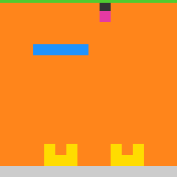

**Situation.** A stream must fill yellow cups, with movable bars between the spout and the cups. Eyeballing a vertical drop is not reliable enough.

**Working hypothesis.** Liquid hitting a bar splits toward both ends, so the ends need to align with cup notches or another useful deflector.

**Action.** Place a bar under the stream and use ACTION5 to pour, watching where each branch falls and which cups or spill lines flash afterward.

**Expected result.** I expect the bar to create two drops; a cup should fill only if liquid reaches its notch without another branch leaking to the spill line.

**Result.** The pour resolves as one action. Failed pours identify missed cups and spills, then remove the liquid while leaving the pieces in place.

**Revised understanding.** I should use the failed pour as a geometric measurement and change the specific bar responsible, rather than shift everything at once.

**Next move.** Adjust the offending endpoint by a small amount and test again while tracking the limited number of failed pours.

**Reconstruction:** action inferred_from_game_evidence; expectation inferred_from_game_evidence; result mechanics_reconstruction.

**Executable example:** [verified replay transitions](evidence/sp80.transitions.jsonl.gz), level 1, 9 actions. Filter by the level field; the final transition records the clear.

## Sucking Up (su15)

[Game write-up](https://arc3.markbarney.net/arc3/games/su15)

### Level 1 — su15:53a23a4caf8d4ae8

**Source note:** Every click plays a brief animation that shows roughly the radius that is about to get sucked up -- the kind of quick animation he suspects a lot of models ignore. Everything inside the radius is pulled to the click point, and two similar objects inside it join and become the bigger object. None of this, including what the animation means, was explained anywhere on the page.

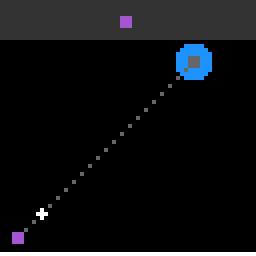

**Situation.** A brief white ring appears around each click, with some pieces inside it and some outside.

**Working hypothesis.** The animation indicates the capture radius. Caught pieces converge on the click point, and matching sizes may merge.

**Action.** Click with matching blocks inside the ring and another block outside, then watch the motion and resulting sizes.

**Expected result.** I expect caught blocks to move inward and compatible overlaps to produce a larger block; the outside block should not be pulled by that click.

**Result.** The player observes inward motion and fusion. The rule check refines it: a whole overlapping group of same-size blocks becomes one next-size block, rather than merging strictly in pairs.

**Revised understanding.** I need to count the whole caught group before clicking. Pulling three together can lose material compared with a pairwise assumption.

**Next move.** Choose a capture region that makes the required size while keeping other valuable blocks outside the overlap.

**Reconstruction:** action expanded_from_recorded_action; expectation inferred_from_game_evidence; result human_report.

**Executable example:** [verified replay transitions](evidence/su15.transitions.jsonl.gz), level 1, 11 actions. Filter by the level field; the final transition records the clear.

### Level 1 — su15:63d19fd2c9744fa8

**Source note:** The game was listed as "Sorting Urn". That was not what it was. The game really is sucking things up, so it was renamed "Sucking Up".

**Situation.** The game was called Sorting Urn, but clicking produces an inward pull and blocks fuse instead of being sorted into fixed compartments.

**Working hypothesis.** The name has biased my model. The useful operation may be suction centered on the click.

**Action.** Click near a block and observe its displacement relative to the clicked point.

**Expected result.** I expect a suction rule to pull toward the point, while a sorting rule would send pieces toward predefined categories or bins.

**Result.** The blocks move toward the click, and compatible blocks fuse. That behavior supports the player's corrected description, Sucking Up.

**Revised understanding.** I should name the mechanism after the transformation I observe, then derive a plan from that mechanism.

**Next move.** Use the pull radius to bring the required blocks together and then deliver the result into the blue circle.

**Reconstruction:** action inferred_from_game_evidence; expectation inferred_from_game_evidence; result mechanics_reconstruction.

**Executable example:** [verified replay transitions](evidence/su15.transitions.jsonl.gz), level 1, 11 actions. Filter by the level field; the final transition records the clear.

### Level 3 — su15:aeaca0863235e30d

**Source note:** Two legends: one in the top left showing what each shape becomes, one in the center showing what to bring to the blue circle. You put the two together to know what to make and where to take it.

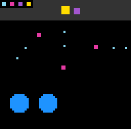

**Situation.** The top-left legend shows a sequence of piece sizes, while the central legend lists pieces wanted inside the blue circles.

**Working hypothesis.** The left legend tells me how to manufacture the objects; the center tells me which finished objects and counts to deliver.

**Action.** Identify each requested piece, trace backward one size in the growth legend, and combine suitable blocks before pulling the result into a circle.

**Expected result.** I expect the completed collection across the circles to match the requested types and counts exactly.

**Result.** The game compares the pooled circle contents with the shopping list. On level 3 it wants a yellow block and a purple block, so indiscriminate merging can destroy a needed intermediate size.

**Revised understanding.** I must plan production and delivery together. Making the biggest available block is not the objective.

**Next move.** Reserve the blocks needed for each requested type and avoid merging a finished requested piece into the next size.

**Reconstruction:** action inferred_from_game_evidence; expectation inferred_from_game_evidence; result mechanics_reconstruction.

**Executable example:** [verified replay transitions](evidence/su15.transitions.jsonl.gz), level 3, 15 actions. Filter by the level field; the final transition records the clear.

### Level 4 — su15:9c5291db5d3253b3

**Source note:** In later levels, little things like alien spaceships appear. The cells, or asteroids, combine and merge, and the spaceships split them up again.

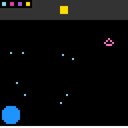

**Situation.** Small lander-like creatures appear among the blocks. Blocks that used to grow by merging can now become smaller after contact.

**Working hypothesis.** The new creatures may alter blocks independently of the vacuum's merging rule.

**Action.** Let a creature approach a block during a click and observe the block's size and direction of motion after contact.

**Expected result.** I expect the interaction to reveal whether the creature combines, splits or transports the block.

**Result.** The creature makes the block drop one size and sends it away; the smallest block is destroyed. The player's description of splitting is useful shorthand, but the checked effect is shrinking and ejection, not two daughter blocks.

**Revised understanding.** I now have a controlled way to reduce size, with a displacement cost. I should not assume that every interaction conserves the same pieces.

**Next move.** Position the creature and click point so the smaller ejected block remains recoverable and can contribute to the requested set.

**Reconstruction:** action inferred_from_game_evidence; expectation inferred_from_game_evidence; result mechanics_reconstruction.

**Executable example:** [verified replay transitions](evidence/su15.transitions.jsonl.gz), level 4, 9 actions. Filter by the level field; the final transition records the clear.

## Toggle Navigator (tn36)

[Game write-up](https://arc3.markbarney.net/arc3/games/tn36)

### Level 1 — tn36:8b6cde77212b3ddd

**Source note:** Something like lab pipetting, or a piano. It never made sense to him and he had to cheat. Level 7 looked close to impossible (his scorecard didn't finish there). A hard one; he doesn't know how anybody solves it.

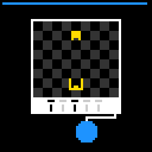

**Situation.** Columns of switches sit under a checkerboard, with a blue run button. The block and target do not suggest an obvious movement control.

**Working hypothesis.** The switches encode a program read from left to right. I can learn one column at a time by varying its switches.

**Action.** Turn on both switches in a single level-1 column and press the blue run button, then repeat with only one switch on.

**Expected result.** I expect each setting to produce a distinct move from the same starting state, revealing an instruction table.

**Result.** Level 1 encodes left as 1, right as 2 and down as 3. Runs begin from the starting state; an unsuccessful run resets the block rather than continuing from its endpoint.

**Revised understanding.** The interface is a sequence of encoded moves. I need to compose instructions and predict the endpoint, not treat the switches like independent directional buttons.

**Next move.** Use the learned codes to move down toward the target; on later levels read the demo tabs to learn rotations, size and color changes.

**Reconstruction:** action inferred_from_game_evidence; expectation inferred_from_game_evidence; result mechanics_reconstruction.

**Executable example:** [verified replay transitions](evidence/tn36.transitions.jsonl.gz), level 1, 10 actions. Filter by the level field; the final transition records the clear.

## Toggle Runes (tr87)

[Game write-up](https://arc3.markbarney.net/arc3/games/tr87)

### Level 1 — tr87:ec673f14d5da4960

**Source note:** The winning sequence is right there on screen, and the symbols in it are rotated. That is the bizarre, counterintuitive part: a rune turned a quarter turn is still the same rune, so a sequence can be correct while looking nothing like the one in the dictionary. Every other kind of symbol reading a person does is orientation-sensitive, and here orientation is noise you have to learn to ignore.

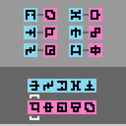

**Situation.** The same-looking rune appears in different quarter-turn orientations, and an answer can be correct even when it is not oriented like the dictionary image.

**Working hypothesis.** I have been treating orientation as part of identity. The game may compare the underlying rune while treating rotation as decoration.

**Action.** Compare the rune's branches under quarter turns, identify its dictionary partner and select that partner even if the rendered orientation differs.

**Expected result.** I expect the translation to remain valid when the symbol identity matches despite the rotation.

**Result.** The player's accepted matches show that a quarter-turned rune can still be the same symbol.

**Revised understanding.** I can use rotation-normalized recognition without claiming I have already verbalized every translation rule.

**Next move.** Build the answer from symbol identities and dictionary pairings, checking rotations only to recognize a match.

**Reconstruction:** action inferred_from_game_evidence; expectation expanded_from_recorded_expectation; result human_report.

**Executable example:** [verified replay transitions](evidence/tr87.transitions.jsonl.gz), level 1, 17 actions. Filter by the level field; the final transition records the clear.

### Level 1 — tr87:86e36e9a42bc6ca1

**Source note:** A run in progress, and then the arcprize.org site dropped his scorecard mid-game. He won it on the replay: 6/6, score 100, 211 actions, no resets, under baseline on every level. Before that evening this game had never given him a single level.

**Situation.** The scorecard disappeared during play, forcing a new attempt even though I had begun to understand the translation task.

**Working hypothesis.** The session state is lost, but the learned dictionary-reading method should transfer to another attempt.

**Action.** Start again and decode each requested phrase using the visible dictionary instead of repeating an exact remembered sequence of arrow presses.

**Expected result.** I expect a method based on the current symbols to work even if selection states or arrangements differ.

**Result.** The player reports a subsequent full six-level win with 211 actions and no resets.

**Revised understanding.** The durable result of the earlier attempt was knowledge of how to read the puzzle, not the interrupted session's progress.

**Next move.** Continue matching current symbols and switch to repairing the dictionary when the editable region changes on the final levels.

**Reconstruction:** action expanded_from_recorded_action; expectation inferred_from_game_evidence; result human_report.

**Executable example:** [verified replay transitions](evidence/tr87.transitions.jsonl.gz), level 1, 17 actions. Filter by the level field; the final transition records the clear.

### Level 3 — tr87:0f0b1c08fa6a0216

**Source note:** The only controls are up, down, left, right and RESET, and RESET is not something you should need in this game. Even on level 3 there is no solid rule he has been able to pin down. It is a lot like SB26: the game asks you for a certain code, only with freaky-looking symbols instead of colors. The symbols also do not always have to be pointed the right way. Once you know that much it is shockingly easy -- and it would have taken him literally forever if nobody had told him, because it just would not occur to you. He is still playing it badly. It is programmer talk turned into a game, working in abstractions: the top half of the screen always shows you the key, what the game wants, and in the bottom half you cycle through the runes with the arrow keys.

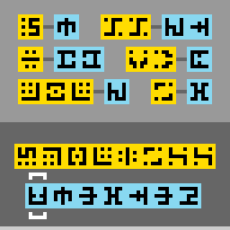

**Situation.** The upper half shows symbol mappings and the requested phrase; the lower answer row has a movable selection bracket.

**Working hypothesis.** The task is translation through a visible dictionary, similar to constructing the requested color code in Sequence Belt.

**Action.** Move the bracket with left or right and cycle the selected answer glyph with up or down until it matches the dictionary translation.

**Expected result.** I expect the answer to be judged by the translated rune sequence, including identities shown in different orientations.

**Result.** Once the player understands the code-translation framing, the puzzle becomes much easier despite its unfamiliar symbols.

**Revised understanding.** The controls edit symbols in an answer, not the positions of objects in a spatial puzzle.

**Next move.** Resolve the next input chunk through the dictionary and set the corresponding answer glyph rather than guessing by overall visual similarity.

**Reconstruction:** action expanded_from_recorded_action; expectation inferred_from_game_evidence; result human_report.

**Executable example:** [verified replay transitions](evidence/tr87.transitions.jsonl.gz), level 3, 26 actions. Filter by the level field; the final transition records the clear.

### Level 4 — tr87:86b5b6a9467479a0

**Source note:** In a lot of these games you have to press spacebar or some other action to confirm that the sequence you entered is the one you want. There is none. The moment the sequence is right it lights up, flashes, plays an animation and takes you to the next level. Bizarre.

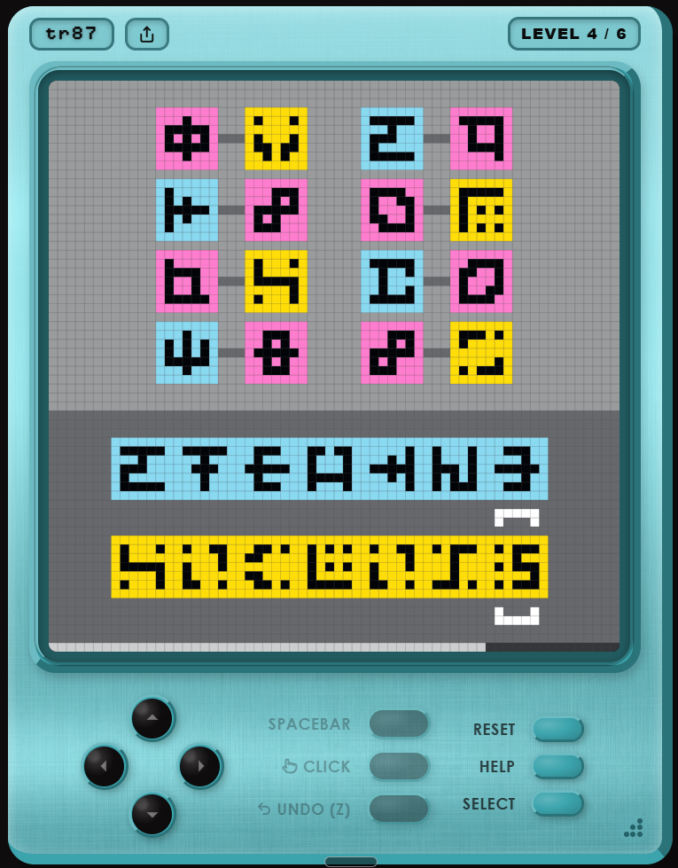

**Situation.** The answer is one correction away, and I expect a separate submit action because other games use spacebar to confirm.

**Working hypothesis.** The sequence may validate continuously instead of waiting for confirmation.

**Action.** Change the final incorrect glyph with the arrow keys and watch the board before looking for a submit control.

**Expected result.** I initially expect to need another press to confirm the completed sequence.

**Result.** The correct sequence flashes, animates its translation and advances immediately. The paired human screenshots capture the level-4 board just before and during that transition.

**Revised understanding.** The answer is checked after editing. Confirmation is feedback from the environment, not a separate action I must discover.

**Next move.** On the next level, first inspect where selection is allowed instead of spending actions searching for a confirm button.

**Reconstruction:** action inferred_from_game_evidence; expectation expanded_from_recorded_expectation; result human_report.

**Executable example:** [verified replay transitions](evidence/tr87.transitions.jsonl.gz), level 4, 21 actions. Filter by the level field; the final transition records the clear.

### Level 5 — tr87:b76e6d5d4286f511

**Source note:** On level 5 he is only allowed to select things up in the area that previously gave him the legend. The puzzle is inverted from here: the answer row is already right and frozen, and the dictionary itself is what you change.

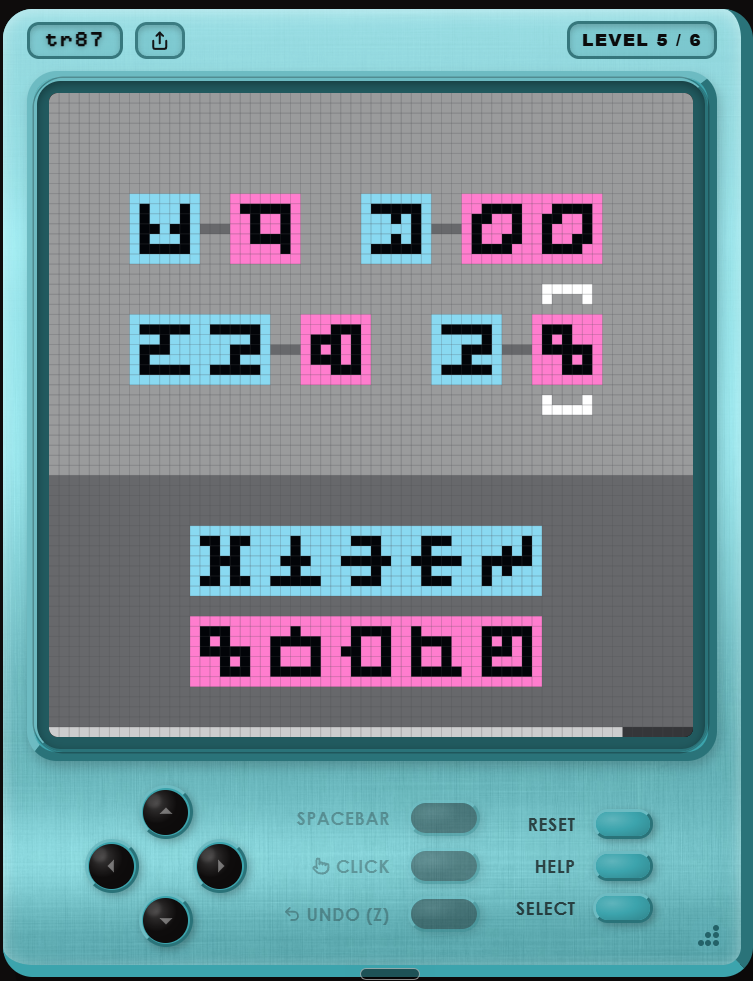

**Situation.** The answer row is frozen and the selection bracket has moved up into the dictionary.

**Working hypothesis.** The game has reversed which part is wrong: I must change a mapping so the fixed answer becomes a valid translation.

**Action.** Select a dictionary side and cycle its symbols, comparing the resulting mapping with the fixed phrase and answer.

**Expected result.** I expect a correct dictionary to reconcile the already fixed rows, without editing the answer itself.

**Result.** The player's observation and screenshot show dictionary editing on level 5. The code changes the selected dictionary side rather than a lower answer glyph.

**Revised understanding.** The same translation relation now acts as a constraint on the dictionary. I must reconsider what is editable at each new level.

**Next move.** Use the fixed input and output to determine the inconsistent dictionary entry, then change that entry while preserving the other mappings.

**Reconstruction:** action inferred_from_game_evidence; expectation inferred_from_game_evidence; result human_report.

**Executable example:** [verified replay transitions](evidence/tr87.transitions.jsonl.gz), level 5, 14 actions. Filter by the level field; the final transition records the clear.

## Trail Unwind (tu93)

[Game write-up](https://arc3.markbarney.net/arc3/games/tu93)

### Level 2 — tu93:f99be0233112d874

**Source note:** A small board. One of the easier and more fun ones. You move two squares at a time, the animations matter, and to avoid some enemies you have to backtrack and take the least efficient route.

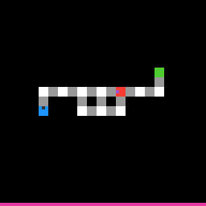

**Situation.** The board is small, but a direct-looking route passes in front of an enemy whose animation signals its facing.

**Working hypothesis.** The shortest geometric path may be unsafe. A detour could change my approach so I can attack from the side.

**Action.** Backtrack to a branch and travel around the threatened front pad instead of continuing straight toward the enemy.

**Expected result.** I expect a longer route to permit a safe side or rear entry onto the enemy's pad.

**Result.** The player reports that backtracking and taking apparently inefficient routes is necessary against some enemies; the facing rule explains why.

**Revised understanding.** My path cost must include survival. A short route through a threatened landing is not a usable shortcut.

**Next move.** Predict the landing pad and enemy facing for each move, choosing a detour that reaches a safe attack direction.

**Reconstruction:** action inferred_from_game_evidence; expectation inferred_from_game_evidence; result mechanics_reconstruction.

**Executable example:** [verified replay transitions](evidence/tu93.transitions.jsonl.gz), level 2, 15 actions. Filter by the level field; the final transition records the clear.

### Level 2 — tu93:cf09a67b6f7d1e36

**Source note:** Level 2 introduces an enemy: a red figure with a purple dot in it. Straight on, it bites you and kills you. Going around and coming at it from the side, you bite it and destroy it. The page never mentioned this enemy at all, and it is a huge mechanic.

**Situation.** A red enemy has a purple dot, and a head-on approach is possible along the wire.

**Working hypothesis.** The dot may indicate a dangerous front. I can distinguish proximity from facing by comparing a front approach with a side approach.

**Action.** Approach from the front, then on a new attempt go around and step onto the enemy's pad from the side.

**Expected result.** I initially expect contact to behave similarly from either direction; the comparison tests whether approach direction changes who is destroyed.

**Result.** The front approach kills the player, whereas the side approach destroys the enemy. The code identifies the pad in front of the dot as the threatened landing.

**Revised understanding.** Enemy interaction is directional. Crossing or ending in front is different from stepping onto its own pad from the side or rear.

**Next move.** Route around the threatened pad and attack from a side or rear connection.

**Reconstruction:** action expanded_from_recorded_action; expectation inferred_from_game_evidence; result human_report.

**Executable example:** [verified replay transitions](evidence/tu93.transitions.jsonl.gz), level 2, 15 actions. Filter by the level field; the final transition records the clear.

## Volume Control (vc33)

[Game write-up](https://arc3.markbarney.net/arc3/games/vc33)

### Level 5 — vc33:d0153749d118f4d0

**Source note:** Level 5 of 7 is one of the levels turned 90 degrees counterclockwise since the preview, so the tanks run sideways. The yellow piece has to get through a gate and up to where it wants to be, and the gates only show up once you make them appear. That is the order the level wants: green has to go down first and yellow gets finished later. Devious.

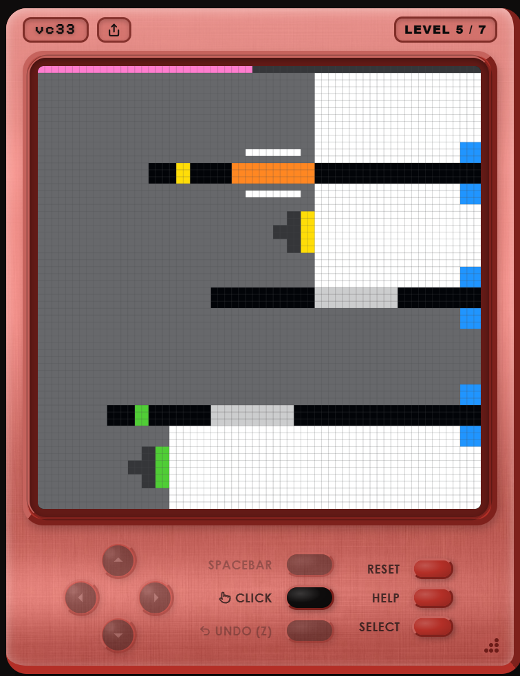

**Situation.** The sideways tanks show green already down in the lower region in the human capture, while yellow still needs to pass an orange gate.

**Working hypothesis.** Working on yellow first may prevent the tank levels or gate arrangement needed to place green. Green should be settled before I finish yellow.

**Action.** After the failed attempt, move green down first, then adjust the relevant tank surfaces to open yellow's transfer gate.

**Expected result.** I expect the orange gate to become usable when both adjacent surfaces align with it, allowing yellow to cross and finish afterward.

**Result.** The player reports that green-first, yellow-later worked. The screenshot shows that intermediate handoff state.

**Revised understanding.** The two riders' objectives interact through shared fluid levels and gate access. Placement order is part of the solution.

**Next move.** Preserve green's useful placement while moving yellow through the active gate, then pump yellow to its matching stripe.

**Reconstruction:** action expanded_from_recorded_action; expectation inferred_from_game_evidence; result human_report.

**Executable example:** [verified replay transitions](evidence/vc33.transitions.jsonl.gz), level 5, 49 actions. Filter by the level field; the final transition records the clear.

### Level 6 — vc33:b3833b7f59eafc92

**Source note:** Level 6 needs the volume indicators, which show how much liquid is in each part, read pixel-perfect. Insane, and very confusing. He took a screenshot out of pure frustration.

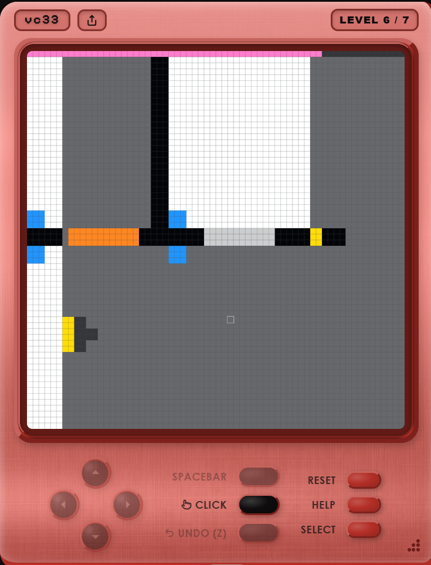

**Situation.** The sideways liquid boundaries and black obstructions make the riders' exact offsets hard to read.

**Working hypothesis.** The relevant quantities are the distance from each surface to its target and whether a bar limits further pumping, not the apparent height of a vertical tank.

**Action.** Measure the surface-to-target gap in grid cells and click a pump once while watching both connected tanks.

**Expected result.** I expect one surface to advance and the other to retreat by the fixed step for this level, unless an obstruction or rider clearance blocks it.

**Result.** On level 6 a valid pump step is three pixels. Black bars can limit capacity, and a rider can make the limit stricter, explaining why visually plausible clicks may do nothing.

**Revised understanding.** I should reason in exact increments along the tank's orientation. Approximate visual alignment can waste the small click budget.

**Next move.** Compute which pump sequence reaches the remaining target offsets without exceeding a bar-imposed limit.

**Reconstruction:** action inferred_from_game_evidence; expectation inferred_from_game_evidence; result mechanics_reconstruction.

**Executable example:** [verified replay transitions](evidence/vc33.transitions.jsonl.gz), level 6, 20 actions. Filter by the level field; the final transition records the clear.

## Warehouse Associates (wa30)

[Game write-up](https://arc3.markbarney.net/arc3/games/wa30)

### Level 6 — wa30:5ad0be76725b6a4f

**Source note:** Some of the other moving objects work with you, and some work against you. The whole game has been crazy. He doubts an AI will realize which of the moving objects are on its side and which are against it. Interesting.

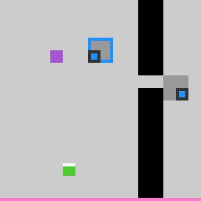

**Situation.** Other haulers move after my actions. Orange figures move crates toward bays, while a purple figure can move them toward a different region.

**Working hypothesis.** The colors may identify different objectives rather than cosmetic variants of one helper behavior.

**Action.** Track one crate across several of my actions and note which hauler takes it and where it is delivered.

**Expected result.** I expect a helper to increase crates in the blue bays and a thief to remove them or deliver them to its gray area.

**Result.** The player's impression matches the checked behaviors: helpers and thieves pursue opposing destinations, and thieves can take already useful crates.

**Revised understanding.** I should model each moving actor's objective and turn timing before deciding whether to let it work or intervene.

**Next move.** Leave accessible loose crates for helpers while protecting completed placements from the thief.

**Reconstruction:** action inferred_from_game_evidence; expectation inferred_from_game_evidence; result mechanics_reconstruction.

**Executable example:** [verified replay transitions](evidence/wa30.transitions.jsonl.gz), level 6, 46 actions. Filter by the level field; the final transition records the clear.

### Level 3 — wa30:177b4d54ab22671a

**Source note:** On level 3 the boxes have to go on the area in the middle. That was not obvious at all. After that the orange helper does the rest, and you just have to trust it will do it correctly. There is literally nothing for the character to do on level 3 once the boxes are down. Weird, but interesting.

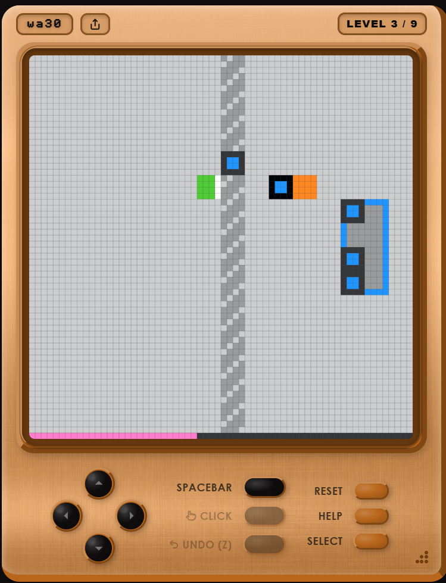

**Situation.** The human capture shows a middle handoff area, the player on one side and an orange helper on the other with access to the bays.

**Working hypothesis.** The helper can finish a delivery if I place the crates where it can reach them and then release them.

**Action.** Move the crates into the middle area, let go and make subsequent moves while watching the helper.

**Expected result.** I expect the helper to collect the loose crates and carry them into the blue bays without my escort.

**Result.** That is what the player reports: once the boxes were handed off, the orange helper did the rest while the player walked around.

**Revised understanding.** The work is divided by reach and behavior. Continuing to hold or disturb the crates would prevent the helper from completing its part.

**Next move.** Stay clear of the helper's route and let enough turns pass for it to grab, carry and release the remaining crates.

**Reconstruction:** action expanded_from_recorded_action; expectation inferred_from_game_evidence; result human_report.

**Executable example:** [verified replay transitions](evidence/wa30.transitions.jsonl.gz), level 3, 74 actions. Filter by the level field; the final transition records the clear.

### Level 7 — wa30:e19a258d650f013c

**Source note:** Level 7 was crazy, with a purple guy on the board. He had not realized he could destroy the purple guy.

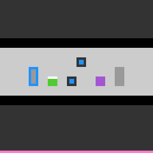

**Situation.** A purple hauler is interfering with the crates. I have been treating it as a permanent moving obstacle.

**Working hypothesis.** ACTION5 may interact with a facing actor as well as a facing crate, letting me remove the thief.

**Action.** Move next to the purple thief, face it and press ACTION5.

**Expected result.** I expect either a normal no-op or an interaction that stops the thief from undoing my deliveries.

**Result.** The code removes the facing thief from the level; if it was carrying a crate, the crate is released where it stands. The player's note identifies this previously missed possibility.

**Revised understanding.** I do not have to solve around an active adversary indefinitely. Facing and interacting can change the set of actors on the board.

**Next move.** Remove the disruptive thief when it is economical, then retrieve its crate and complete the bays.

**Reconstruction:** action inferred_from_game_evidence; expectation inferred_from_game_evidence; result mechanics_reconstruction.

**Executable example:** [verified replay transitions](evidence/wa30.transitions.jsonl.gz), level 7, 44 actions. Filter by the level field; the final transition records the clear.

### Level 9 — wa30:1d2c1be10f2c335e

**Source note:** Level 9, the final level. He had a lot of trouble running out of time. So far WA30 is the only game where running out of time has been a real problem for him as a human.

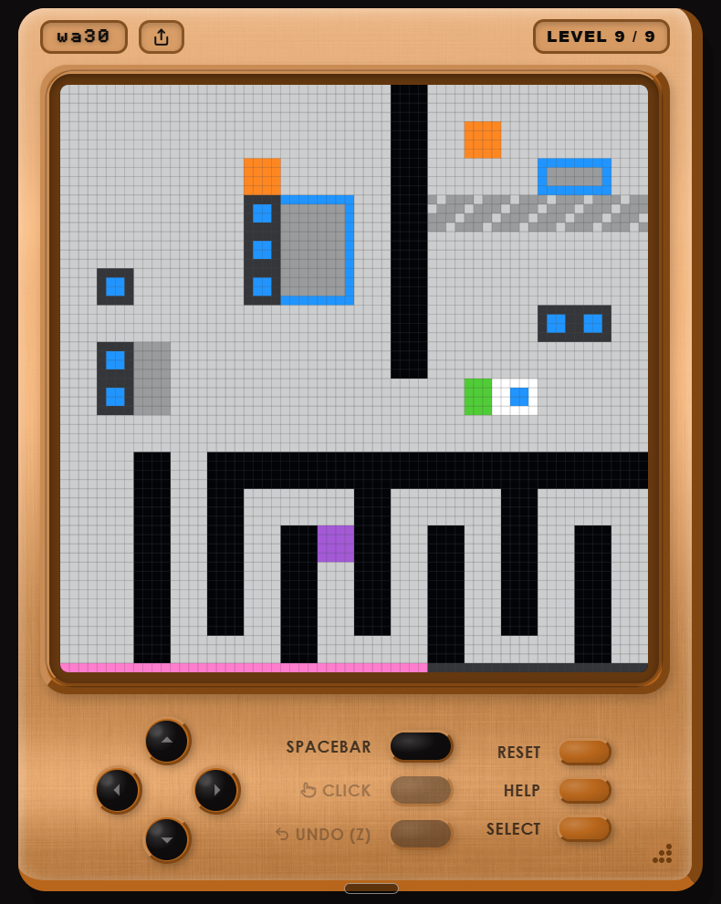

**Situation.** The final capture has separated work areas, crates and a narrow route, while the player reports repeatedly running out of time.

**Working hypothesis.** My failures may come from wasted counted actions rather than a real-time clock. Selection, facing, grabbing, releasing and blocked moves all consume the budget.

**Action.** Plan the crate destinations and hauling route before moving; count the necessary grabs and releases as well as travel.

**Expected result.** I expect a shorter complete action sequence to preserve enough budget to release the last crate in a bay.

**Result.** Level 9 has a 70-action budget. Every action counts, and a crate held inside a bay is not finished until released.

**Revised understanding.** I need to minimize the full interaction sequence, not just walking distance. Pausing to plan does not spend game actions.

**Next move.** Remove avoidable turns and empty interactions, and reserve the final release action when checking whether the route fits.

**Reconstruction:** action expanded_from_recorded_action; expectation inferred_from_game_evidence; result mechanics_reconstruction.

**Executable example:** [verified replay transitions](evidence/wa30.transitions.jsonl.gz), level 9, 62 actions. Filter by the level field; the final transition records the clear.
