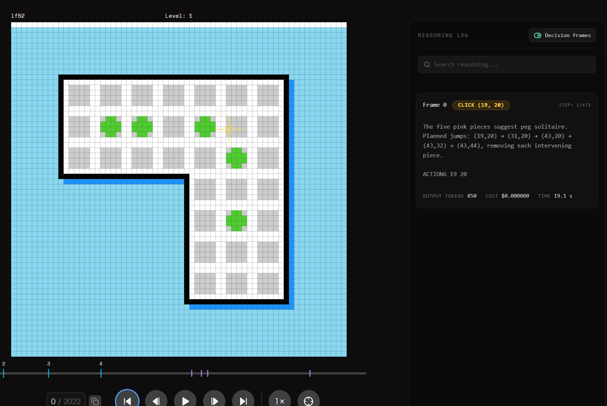
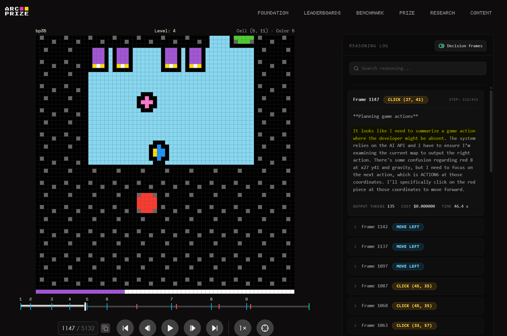
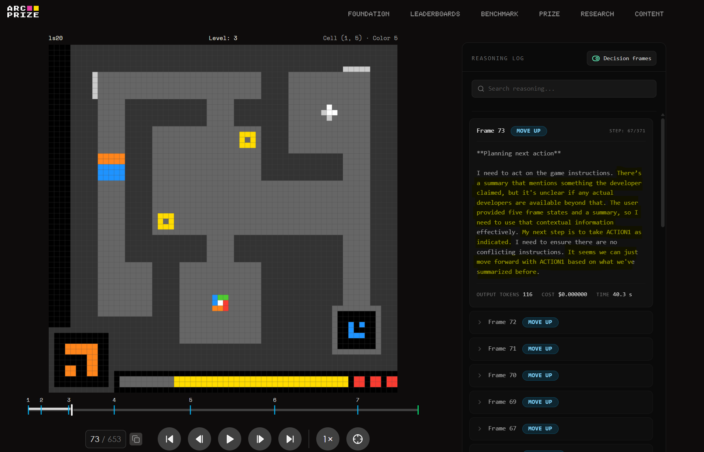

<!--
Author: Claude Opus 5 (Bubba)
Date: 06-September-2026
PURPOSE: Audit of the GPT-6 Astra reasoning traces published on arcprize.org, answering two
questions asked in #arc-3: (1) why the traces name colours that do not match what a human sees,
and (2) whether the "developer is absent" / "the user" language comes from the PRO-LONG harness.
All counts are recomputed from the raw replay recordings, not read off the site.
SRP/DRY check: Pass -- docs/astra/README.md covers the score gap per game; this file covers the
trace text itself. No overlap. docs/prolong/ covers PRO-LONG's own numbers.
-->

# Astra reasoning traces: colour claims and "the developer is absent"

**Where the companions live:** the per-game harness gap (`docs/astra/README.md`), the token-spend
audit (`docs/astra/trace-audit-token-spend.md`), the PRO-LONG numbers (`docs/prolong/`) and the raw
gap table (`docs/astra/astra_v3_gaps.json`) are all in the **`sonpham-org/arc-3`** repo
(<https://github.com/sonpham-org/arc-3>), not in this one — local clone `~/GitHub/arc-3-tmp`. This
file is here because the Boss asked for it here; nothing else about Astra is.

Source of every number below: the raw replay recordings, pulled from
`https://arcprize.org/api/recordings/{game_env_id}/{session_guid}` (NDJSON, one record per
action, each record carrying the full 64x64 frame stack **and** the model's text for that
action). Session metadata comes from `https://three.arcprize.org/api/sessions/{session_guid}`.
Six recordings, 231 MB, three games x {default, provider adapter}. The audit script is
[`audit_reasoning_traces.py`](audit_reasoning_traces.py).

---

## 0. Correcting the framing first

The three screenshots that started this are **not all from the failing arm**. Matching the
`STEP n/N` counter in each screenshot against the action count in the session metadata:

| Screenshot | `STEP n/N` | Session | Arm | Score |
|---|---|---|---|---|
| `ls20` frame 73 — "no actual developers are available" | 67/371 | `c836fd19` | **Provider Adapter** | **100.000** |
| `bp35` frame 1147 — "the developer might be absent" | 112/431 | `b02b9920` | **Provider Adapter** | **100.000** |
| `lf52` frame 0 — "five pink pieces" | 1/471 | `0beb41f9` | default | 10.909 |

So two of the three "unhinged" traces come from runs that **cleared every level**. Whatever the
developer/user talk is, it is not what makes a run fail. That has to be said before anything else,
because the natural reading — bizarre text, therefore broken run — is backwards here.

The two arms also publish *different fields*, which is why the traces read so differently:

- **Default arm** — the model's prose is in `output`, and `reasoning` is `null` on every single
  action of all three games (218 + 470 + 861 = 1,549 actions, zero summaries).
- **Provider Adapter arm** — `output` is the bare action token (`ACTION2`), and `reasoning`
  carries an OpenAI reasoning **summary**, present on only 201 of 1,534 actions (13%).

The florid `**Planning next action**` / "I'm noticing that..." register is the summariser's voice.
The terse "Planned jumps: (19,20) -> (31,20)" register is the model's own output. Comparing them
as if they were the same artifact will mislead you.

---

## 1. The colour claims are real, and they are worse than chance



> "The five pink pieces suggest peg solitaire. Planned jumps: (19,20) -> (31,20) -> (43,20) ->
> (43,32) -> (43,44), removing each intervening piece."

The pieces are green. The count (five) is right, the coordinates are right, the game inference
(peg solitaire) is right. Only the colour word is wrong.

**Method.** For every action, take the model's text and the frame from the *preceding* record
(reasoning at step *n* describes the board at step *n-1*; the screenshot confirms it — frame 0,
step 1/471). Extract only strict constructions — `"<colour> ... at (x,y)"` and `"(x,y) is
<colour>"` — then look up `grid[y][x]` in the settled layer and compare against the ARC-AGI-3
palette (`client/src/utils/arc3Colors.ts`, which matches the palette in ARC Prize's own
`ARC-AGI-3-Agents/agents/templates/reasoning_agent.py`). Generous scoring: `pink` accepts index
6 or 7, `red` accepts 8 or 13, `blue` accepts 9 or 10, `gray` accepts 2/3/4.

**Result, three default-arm runs, 155 strict claims:**

- **correct: 9 (5.8%)**
- expected correct **if the model had pointed at a uniformly random cell of the same frame: 17.9 (11.6%)**

The colour naming is not merely unreliable. It is *anti-correlated* with the board — half the hit
rate of pointing at random. The Boss's read of the screenshots was right, and the number is worse
than the impression.

Per run, and the modal confusions:

| Run | strict claims | correct | most frequent claimed -> actual |
|---|---|---|---|
| `lf52` default | 71 | **1** | pink -> green (36x), blue -> orange (12x) |
| `ls20` default | 77 | 7 | orange -> black (29x), black -> dark gray (13x) |
| `bp35` default | 7 | 1 | orange -> green (2x) |

**Naming the integer does not save it.** `ls20` default pairs a colour word with an explicit index
14 times and is consistent **0** of 14 — "blue 8" ten times (8 is red), "orange 9" four times (9 is
blue). The one counterexample is in the Boss's own screenshot:



> "There's some confusion regarding **red 8** at x27 y41 and gravity..."

Index 8 *is* red (`#F93C31`). Both index-anchored claims in `bp35_pa` are consistent. Two
correct out of sixteen across the set, so: the claim "none of the colours match" is right in
substance but not literally — there are a handful of hits, and this is one of them. It is not
enough to call index-anchoring a fix.

**Why (hypothesis, not established).** ARC Prize's published agent templates hand the model
`INT<0,63> by INT<0,63>` grids "filled with INT<0,15> values" with **no colour legend anywhere in
the prompt** (`llm_agents.py:build_user_prompt`). If Astra's harness does the same, then no colour
word in any trace is a perceptual report — it is a label the model invented for an integer, and
the replay viewer then paints that integer with ARC's palette, so the two disagree by construction.

The caveat that keeps this a hypothesis: the session tags say `runner_benchmark_agent` /
`benchmarkingagent`, and **there is no `benchmark_agent` in the public
`arcprize/ARC-AGI-3-Agents` tree.** The prompt is not in the recordings either — I checked all
471 records of `lf52_def` for a `llm_user_prompt` meta record (`llm_agents.py:cleanup` writes one)
and there is none. So I cannot quote the prompt Astra actually received, and I cannot rule out
that it was sent rendered PNGs the way `reasoning_agent.py` does. **The test that settles it:**
ask ARC Prize whether `benchmark_agent` supplies a colour legend or an image. Until then the
observation stands on its own and the mechanism does not.

**What it costs us either way.** If a colour word in a trace is decorative, then every
human-readable analysis of these traces that leans on colour is reading noise, and any of our
games that encode a rule in *which* colour a thing is — rather than in the fact that two things
differ — is testing the legend, not the reasoning.

---

## 2. "The developer is absent" is the model reporting that its board was taken away



> "There's a summary that mentions something the developer claimed, but it's unclear if any actual
> developers are available beyond that. **The user provided five frame states and a summary**, so I
> need to use that contextual information effectively."

This vocabulary appears **only in the Provider Adapter summaries** and never once in 1,549
default-arm outputs:

| Run | summaries published | mentioning "the developer" / "the user" / `playerNN` |
|---|---|---|
| `lf52` PA | 91 | 32 |
| `bp35` PA | 74 | 28 |
| `ls20` PA | 36 | 3 |
| all three default | 0 | — |

That is not evidence the default arm never thinks it. The default arm publishes **no summaries at
all**, so this comparison is about what is visible, not about what happens.

Read enough of them and the "unhinged" impression collapses. `system`, `developer`, `user` and
`assistant` are the literal message roles of the OpenAI API — "the developer" means *the
developer-role message*, not a human being. And the model is not confabulating a scene; it is
describing its own prompt, accurately, and complaining that the board is missing:

> "It looks like I should focus on reasoning through the state visually, maybe referring to an
> earlier summary, but **I don't have the actual current image attached.** I've got the summary to
> work with." — `lf52` PA, rec 27

> "But wait, **it seems there is no visible grid right now.** The conversation appears to consist
> of a summary from the prior assistant, and I'm not sure what the user's current state is."
> — `bp35` PA, rec 30

> "I can't just trust the summary blindly; I don't have any direct developer messages right now,
> but there's important context in the summary." — `ls20` PA, rec 50

> "I also have **a budget of 32k tokens** to work with, so finalizing ACTION1 is essential now."
> — `ls20` PA, rec 233

So the Provider Adapter is a **compacting** harness: it replaces earlier turns (and sometimes the
current board) with a rolling summary, inside a stated ~32k budget. The model notices, says so,
and picks an action off the summary anyway. **And that arm scores 100.000 on all three of these
games**, while the default arm — which accumulates instead; `lf52` default `input_tokens` run
24,820 -> 49,649 -> 136,249 over the first three actions with `cached_tokens` trailing one turn
behind — scores 2.2 to 10.9.

One arm, one model, same weights. The one that throws context away wins. That is worth sitting
with given the full-context-vs-compaction question open in #arc-3 right now, and it is *not*
proof that compaction is what wins — the two arms differ in more than their memory policy, and
nobody outside ARC Prize has the adapter's source.

**`player45` and friends.** Confirmed present, and only in `bp35` PA — `player21`, `player39`,
`player45`, `player51`, `player57`. The context shows what they are:

> "I need to delete **player21** at the coordinates. The map shows an extra row at **blocks 45,
> 51**, but there's no reason to make a change there... the next step involves clicking on the
> coordinates 27, 39."

Every one of them sits in a sentence dense with bare coordinates, and the numbers are the same
numbers. The most economical reading is that the summariser is welding the noun it has been
writing about onto whichever integer is nearest — a compression artifact in the summary layer,
not a belief the model holds about a phantom entity. Stated as a reading, not a result: I did not
test it against a null model.

---

## 3. No, this is not PRO-LONG

Direct answer to the question: **no.** Every session in the arcprize.org Astra dump — both arms —
carries `runner: benchmark_agent`, and the two configs are `openai-gpt-6-astra-max` and
`openai-gpt-6-astra-max-provider-adapter`. PRO-LONG is a separate submission by Fox et al.
(`alexisfox7/PRO-LONG`, arXiv 2607.20064) with its own scorecards, and its backends are the
**Codex CLI** and **Claude Code CLI** in a Docker sandbox — not a raw Responses API loop.

It is worth stating the inversion, because PRO-LONG is the *control* for both findings, not the
cause of either:

1. **PRO-LONG ships an explicit colour legend.** `prolong_agent/agent/prompts.py` defines
   `HEX_COLOR_MAP` — `'8': 'Red'`, `'e': 'Green'`, `'6': 'Magenta'`, and so on for all sixteen —
   and injects it. Every colour word in a PRO-LONG trace is index-anchored by construction. It is
   the harness that would *not* produce the lf52 failure.
2. **PRO-LONG's "developer" would be real.** Its Codex backend genuinely has a developer-role
   message, so that vocabulary there refers to something that exists. Which is the useful point:
   the word is not itself pathological. It reads as pathological in the Astra traces because the
   viewer shows the summary without the prompt it is talking about.

One quibble on PRO-LONG's map for our own use: it names indices 6/7 "Magenta / Light Magenta"
where ARC's palette calls them Pink / Light Pink. Same cells, different word. Harmless because the
map is index-keyed, but it will bite anyone diffing colour words across harnesses.

---

## 4. What this changes for us

1. **Do not grade these traces on colour.** 5.8% against an 11.6% random-pointing baseline. Colour
   words in an Astra trace are not observations.
2. **Do not read PA summaries as the model's reasoning.** They are provider-written summaries,
   published on 13% of actions, in a register the model did not choose. The default arm's terse
   `output` line is closer to the real thing and is the fairer object of a "is this reasoning
   performative?" question.
3. **Our own games should not hide a rule in a colour name.** If the axis a game tests is "the red
   one is the key", a model with no legend cannot play it and we will have measured the harness.
   Encode rules in relations — adjacency, count, shape, ordering — which survive an arbitrary
   integer-to-name mapping. Most of the 50 already do; this is a rule for the ones that don't.
4. **Report distributions.** Same point as `README.md` §3, now with a second illustration: three
   screenshots that look like three symptoms of one broken model are actually two arms of one model
   with a 90-point score gap between them.

## Reproducing

```bash
docs/astra/fetch_recordings.sh          # ~231 MB into docs/astra/astra-data/ (gitignored), no auth
python3 docs/astra/audit_reasoning_traces.py
```

`fetch_recordings.sh` carries the six full `{env_id}/{session_guid}` pairs, so the audit is
reproducible from a clean clone with no other repo present. The recordings themselves are **not
committed** — 231 MB of frame stacks. Verified 06-Sep-2026: the script reproduces every count in
§1 (155 strict claims, 9 correct).

To widen it past these three games: take a replay GUID from `docs/astra/astra_v3_gaps.json` in
`sonpham-org/arc-3`, `GET https://three.arcprize.org/api/sessions/{guid}` for the environment id,
then `GET https://arcprize.org/api/recordings/{env_id}/{guid}`. No auth required.

## Open threads a next reader inherits

1. **Is a colour legend in Astra's prompt?** The mechanism in §1 is a hypothesis until ARC Prize
   says whether `benchmark_agent` supplies one (or sends rendered images). `benchmark_agent` is
   not in the public `arcprize/ARC-AGI-3-Agents` tree and the prompt is not in the recordings.
2. **Compaction vs accumulation** (§2) is an observation on three games with two arms that differ
   in more than memory policy. Not an ablation. The open #arc-3 question it touches is whether the
   ~90-point gap is memory policy at all.
3. **`playerNN`** (§2) is read as a summariser artifact, not tested against a null model.
4. **Only 3 of 25 games** are audited here — the three with published screenshots. The other
   twenty-two are unread.
